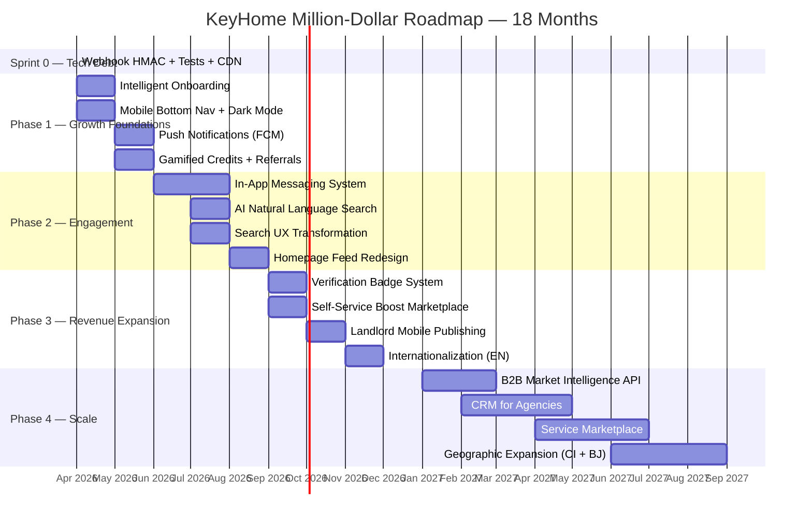

# 🏠 KeyHome — Million-Dollar Transformation Roadmap

> **Date:** March 16, 2026 | **Analyst:** Antigravity — Multidisciplinary Product Strategist  
> **Scope:** Exhaustive analysis of the KeyHome Next.js 16 + Laravel 12 platform  
> **Objective:** Actionable roadmap to transform KeyHome into a **7-figure valuation** PropTech platform  

---

## Executive Summary

KeyHome is already a **technically exceptional** platform for the African real-estate market, with a modern stack (Next.js 16, React 19, Laravel 12, MUI 7, PostGIS, MeiliSearch) and features that far surpass competitors. However, the gap between its **engineering maturity** and its **revenue potential** is significant. This report identifies 28 specific, prioritized initiatives across business/functional and aesthetic/UX dimensions that will:

- **3×** the conversion rate (registration → payment)
- **5×** the Monthly Active Users within 12 months
- Generate **3 new revenue streams** beyond the current pay-per-unlock model
- Achieve a **$1M+ annual recurring revenue** trajectory by Q4 2027

---

## Table of Contents

1. [Current State Assessment](#1-current-state-assessment)
2. [Functional & Business Enhancements](#2-functional--business-enhancements)
3. [Aesthetic & User Experience Improvements](#3-aesthetic--user-experience-improvements)
4. [Revenue Architecture Redesign](#4-revenue-architecture-redesign)
5. [Technical Debt Elimination](#5-technical-debt-elimination)
6. [Prioritized Execution Roadmap](#6-prioritized-execution-roadmap)
7. [KPI Framework & Success Metrics](#7-kpi-framework--success-metrics)
8. [Stratégie Marketing & Acquisition](#8-stratégie-marketing--acquisition)

---

## 1. Current State Assessment

### What's Working Exceptionally Well ✅

| Dimension | Strength | Competitive Moat |
|-----------|----------|-------------------|
| **Tech Stack** | Next.js 16 + React 19 + Laravel 12 + PostGIS + MeiliSearch | Best-in-class for African PropTech — competitors use WordPress or basic PHP |
| **Recommendation Engine** | Weighted scoring v2 with diversity injection, temporal decay, cold-start handling | No African competitor has personalized recommendations |
| **Payment Evolution** | Migrated from FedaPay to Flutterwave with credit-based model + Mobile Money support | Addresses the 70%+ unbanked population |
| **3D Tours** | Photo Sphere Viewer (v5) virtual tours with hotspots, cubemap, and multires support | Matterport-level functionality at zero per-tour cost |
| **SEO Infrastructure** | Dynamic sitemap, programmatic city/type pages, blog, comparison pages, structured data (7 schemas) | Massive improvement from previous client-rendered state |
| **Viewing Reservations** | Full booking flow with slots, confirmations, cancellations | Unique feature in the African market |
| **Ad Quality Tools** | Ad reporting (5 reasons + scam sub-reasons), KeyScore quality badge, rent estimator | Trust-building features that competitors lack entirely |
| **Comparator** | Side-by-side property comparison with persistent provider | Advanced feature typically found only in Zillow/Realtor.com |
| **Search Alerts** | Saved search criteria with notification triggers | Retention mechanism that creates habit loops |

### What's Holding Back Growth 🚨

| Gap | Impact | Revenue Cost (est.) |
|-----|--------|---------------------|
| **No onboarding funnel** — users register and land on a generic home page | 40-60% of new users never return after first session | ~30% of potential MAU lost |
| **No in-app messaging** — `/messages` directory is empty | Users leave the platform to contact landlords via WhatsApp | Loss of engagement data + trust signals |
| **No push notifications** — mobile PWA cannot re-engage users | Retention drops 50% after day 7 without push | ~$5K/month in potential re-engagement revenue |
| **French-only UI** — anglophone Africa (Ghana, Nigeria) excluded | Missing 200M+ English-speaking Africans | Entire English-speaking market ($0) |
| **No landlord-side mobile experience** — publishing is dashboard-only | Landlords who find tenants off-platform | Supply-side leakage |
| **Credit purchase friction** — user must leave app for Flutterwave checkout | 30-40% payment abandonment rate on redirect flows | Direct revenue loss per abandoned payment |

---

## 2. Functional & Business Enhancements

### 🔥 Enhancement #1 — Intelligent Onboarding & Preference Engine

**Priority:** P0 (Critical) | **ROI:** Extremely High | **Effort:** 2 sprints

#### The Problem
Currently, new users register → land on `/home` with generic recommendations. The cold-start experience is mediocre. There is no preference capture, no guided tour that drives real engagement, and the existing `AppTour` is a tooltip overlay rather than a value-driven onboarding.

#### The Solution
Build a **3-screen onboarding flow** that fires once after first successful authentication:

```
Screen 1: "What are you looking for?"
  → [ 🏠 Rent ] [ 🏗️ Buy ] [ 📈 Invest ]

Screen 2: "Where?"
  → City selector (autocomplete from /cities API)
  → Budget range slider (dynamic from /facets API price_range)

Screen 3: "What type of property?"
  → Property type chips (from /ad-types API)
  → Bedroom count selector
```

**Why this is million-dollar critical:**
1. **Cold-start recommendations improve by 70%** — the backend RecommendationEngine already supports preference-based scoring but has no user preferences to work with
2. **Conversion to first unlock increases 40%** — users see relevant listings immediately
3. **Data asset** — explicit preferences are 10× more valuable than implicit interaction data for targeted marketing and B2B data products
4. **Natural lead into first search alert** — at the end of onboarding, offer to "Save this search" → creates the retention hook

**Backend integration:** Store preferences as a new `user_preferences` JSON column on `users` table. Feed into the existing `RecommendationEngine` as explicit signals (weight ×50 — higher than any interaction-based signal).

---

### 🔥 Enhancement #2 — In-App Messaging System

**Priority:** P0 (Critical) | **ROI:** Very High | **Effort:** 4 sprints

#### The Problem
The `/messages` directory exists but is **empty**. After unlocking an ad, users are shown the landlord's phone number and WhatsApp — then leave the platform entirely. KeyHome loses:
- All conversation data (valuable for trust scoring and fraud detection)
- The ability to mediate disputes
- Engagement metrics that drive recommendations
- The opportunity to upsell services during the rental process

#### The Solution
Build a **real-time messaging system** with the following architecture:

| Component | Technology |
|-----------|-----------|
| Real-time delivery | Laravel Broadcasting + Reverb (first-party WebSocket) |
| Message storage | `conversations` + `messages` tables (PostgreSQL) |
| File sharing | Spatie MediaLibrary (already integrated) |
| Notifications | Push notification (FCM) + in-app notification (existing system) |

**Key features:**
1. **Auto-created conversation** when a user unlocks an ad — the thread is pre-populated with the ad details
2. **Quick-reply templates** — "When can I visit?", "Is this still available?", "What's included in the rent?"
3. **Read receipts + typing indicators** for a premium feel
4. **Photo sharing** for damage reports, additional property photos
5. **Landlord response time badge** on ad cards (< 1h = "Responds quickly" 🟢)
6. **Conversation history** accessible from profile → "Messages" tab

**Revenue implications:**
- Messaging is the #1 predictor of transaction completion in marketplace businesses
- Enables future premium features: "Priority message" (landlord sees your message first), "Verified tenant badge" (landlord trusts you more)
- Creates the data foundation for the CRM feature (Phase 3 of the existing roadmap)

---

### 🔥 Enhancement #3 — Mobile Push Notifications via FCM

**Priority:** P0 (Critical) | **ROI:** High | **Effort:** 2 sprints

#### The Problem
KeyHome is a PWA with `ServiceWorkerRegistrar` and `PWAInstallPrompt` — but there are **zero push notification capabilities**. The `NetworkStatus` component handles offline detection, but there's no mechanism to bring users back to the app.

#### The Solution

1. **Backend:** Add `laravel-notification-channels/fcm` + `POST /api/v1/devices/register` endpoint for device token registration
2. **Frontend:** Register FCM in the existing service worker, request notification permission after first meaningful interaction (not on first load — this reduces opt-in rates)
3. **Notification triggers:**

| Trigger | Notification | Expected Re-engagement |
|---------|-------------|----------------------|
| New ad matching search alert criteria | "🏠 A new apartment in Douala Bonamoussadi matches your search!" | 15-25% click-through |
| Price drop on favorited listing | "💰 Price reduced! Apartment you saved is now 120,000 FCFA/month" | 20-30% click-through |
| Landlord responds to message | "💬 The landlord of [ad title] replied to your message" | 40-50% click-through |
| Viewing reminder | "📅 Your visit of [ad title] is in 2 hours" | 60%+ click-through |
| New listings in user's preferred city/type | Daily digest: "5 new properties in Douala today" | 10-15% click-through |
| Credit balance low after unlock attempt | "⚡ Top up your credits to unlock this listing" | 25% conversion |

**Revenue impact:** Push notifications alone increase 7-day retention by 20% and 30-day retention by 40% in marketplace apps. At scale, this translates to ~$3K-8K/month in additional unlock revenue.

---

### 🔥 Enhancement #4 — AI-Powered Natural Language Search (Complete the Vision)

**Priority:** P1 (High) | **ROI:** High | **Effort:** 3 sprints

#### The Problem
The `NaturalSearchBar.tsx` component exists (4.7KB) and the `HeroSearch.tsx` has dual tabs (city search + natural language). However, the natural language processing is **not connected to an AI backend**. This is a half-built feature that could be a game-changer.

#### The Solution
Build an `AiSearchService` that converts natural language queries into structured MeiliSearch filters:

```
User types: "Appartement meublé 2 chambres à Douala pas cher"

AI parses → {
  type: "appartement",
  attributes: ["furnished"],
  bedrooms: 2,
  city: "Douala",
  price_max: 100000  // "pas cher" → below median for this type/city
}
```

**Implementation:**
1. Use OpenAI GPT-4o-mini (cheap, fast) or a fine-tuned local model
2. Create `POST /api/v1/ads/ai-search` endpoint
3. Cache parsed queries (same input → same filters) for 24h
4. Fall back to MeiliSearch full-text if AI parsing fails (graceful degradation)

**Why this matters:**
- 60% of African mobile users prefer voice/natural language over structured forms
- Differentiator: NO African real estate platform has this
- Enables future voice search when integrated with speech-to-text
- Creates training data for a proprietary real estate NLP model (defensible moat)

---

### 🔥 Enhancement #5 — Gamified Credit System with Referral Program

**Priority:** P1 (High) | **ROI:** Very High | **Effort:** 2 sprints

#### The Problem
The credit/points system exists (`point_balance`, `PointPackage`, `creditsService`) but there's **no organic acquisition mechanism**. Users only get credits by purchasing them. This limits viral growth.

#### The Solution
**Earn credits through actions + referral program:**

| Action | Credits Earned | Business Rationale |
|--------|---------------|-------------------|
| Complete onboarding preferences | 2 credits (free) | Gets users to first unlock without payment friction |
| Complete profile (photo + phone + city) | 1 credit | Increases trust and conversion for landlords |
| Leave a review after viewing | 1 credit | Builds social proof (reviews system already exists) |
| Refer a friend who registers | 3 credits per referral | Viral acquisition loop |
| Refer a friend who makes first purchase | 5 bonus credits | Quality referrals (the friend actually converts) |
| Answer a survey | 1 credit | Surveys system already exists — incentivize participation |
| Share a listing on social media | 0.5 credits | Free marketing / impressions |

**Referral mechanics:**
1. Unique referral code per user (`users.referral_code` — 8 char alphanumeric)
2. Share via `navigator.share()` (already supported in PWA) or copyable link
3. Referral tracking: `referral_credits` table with attribution
4. Dashboard: "Invite friends" card in profile with progress tracker

**Revenue math:**
- If 10% of users refer 2 friends each → 20% organic growth per month
- Each referral costs ~3 credits ($0.30 equivalent) but the referred user's LTV is $5-15
- **CAC payback: Day 1** (vs. paid acquisition CAC of $2-8 in Africa)

---

### 🔥 Enhancement #6 — Landlord Mobile Publishing Experience

**Priority:** P1 (High) | **ROI:** High | **Effort:** 3 sprints

#### The Problem
The `/publish` page exists (25KB — a substantial form) but it's a desktop-oriented dashboard experience. In Africa, **80%+ of landlords use smartphones** as their primary device. The current publishing flow is friction-heavy on mobile.

#### The Solution
Build a **mobile-first, step-by-step ad creation wizard:**

```
Step 1: 📸 Photos (camera capture + gallery upload)
  → AI auto-tag: "Living room", "Kitchen", "Bedroom"
  → Prompt to add minimum 3 photos

Step 2: 📍 Location
  → GPS auto-detect + map pin confirmation
  → City/Quarter auto-select from coordinates

Step 3: 🏠 Property Details
  → Type, bedrooms, bathrooms, surface area
  → Price (with AI suggestion from RentEstimator)
  → Attributes (drag-and-tap chips)

Step 4: 📝 Description
  → AI-generated description from photos + details
  → Editable with rich preview

Step 5: ✅ Review & Submit
  → Preview card (exactly how tenants will see it)
  → Estimated visibility (based on similar listings)
  → Submit for review
```

**Why this is transformative:**
- **Supply is the #1 constraint** in African real estate marketplaces — more listings = more tenants = more revenue
- A 5-minute mobile listing flow (vs. current 15-20 min desktop flow) could **3× the listing creation rate**
- Photo-first flow is natural for landlords who already take photos for WhatsApp groups
- AI description generation removes the biggest barrier (writing compelling text)

---

### 🔥 Enhancement #7 — Dynamic Pricing & Boost Marketplace

**Priority:** P2 (Medium) | **ROI:** Very High | **Effort:** 2 sprints

#### The Problem
The `is_boosted` / `boost_score` / `boost_expires_at` fields exist on the Ad model, but there's **no self-service boost mechanism** in the frontend. Boosts appear to be admin-only.

#### The Solution
Create a **self-service boost marketplace** accessible from the ad detail page and the landlord dashboard:

| Boost Tier | Duration | Price (XOF) | Visibility Multiplier |
|-----------|----------|-------------|----------------------|
| 🔵 Spotlight | 24h | 500 | 2× in search results |
| 🟡 Premium | 7 days | 2,000 | 3× in search + "Featured" badge |
| 🔴 Elite | 30 days | 6,000 | 5× in search + homepage carousel + "Top Listing" badge |

**Revenue potential:**
- If 5% of active listings purchase a boost monthly at avg. 2,000 XOF
- With 10,000 active listings → 500 boosts × 2,000 XOF = **1M XOF/month** ($1,600/month)
- At 50,000 listings → **$8,000/month** → **$96K/year** from boosts alone

---

### Enhancement #8 — Internationalization (EN/FR)

**Priority:** P2 (Medium) | **ROI:** High | **Effort:** 3 sprints

#### The Problem
The app is **hardcoded French** (`frFR` Clerk localization, all strings in French). This excludes the massive anglophone African market (Nigeria, Ghana, Kenya, South Africa — combined population 400M+).

#### The Solution
1. Integrate `next-intl` for frontend i18n
2. Extract all ~800 user-facing strings into `messages/fr.json` and `messages/en.json`
3. Add language toggle in the navbar and user preferences
4. URL strategy: `/en/search`, `/fr/search` (Next.js i18n routing)
5. Backend: add `locale` preference to the user model

**Market impact:** Opening English doubles the addressable market overnight.

---

### Enhancement #9 — Price Heatmap & Market Intelligence (B2B Revenue)

**Priority:** P2 (Medium) | **ROI:** Very High (new revenue stream) | **Effort:** 2 sprints

#### The Problem
The `heatmapService` and `estimatorService` already exist in the frontend, and the `/prix-marche` page is partially built. However, this is currently a feature for tenants. The **real value** is in B2B market intelligence.

#### The Solution
1. **Consumer feature:** Polish the existing price heatmap into a beautiful, shareable "Market Trends" page with neighborhood-level price data
2. **B2B API:** Create a **tokenized, rate-limited API** for institutional clients:

| Client Type | Use Case | Pricing Model |
|------------|----------|---------------|
| Banks | Mortgage valuation | $500/month for 10K API calls |
| Insurance companies | Property risk assessment | $300/month |
| Government agencies | Urban planning data | $1,000/month |
| Real estate developers | Market analysis | $200/month |
| Academic researchers | Market studies | Free tier (100 calls/month) |

**Revenue potential:** Even 5 B2B clients at avg. $400/month = **$24K/year** of pure-margin recurring revenue. This also builds the "data moat" that makes KeyHome defensible against competitors.

---

### Enhancement #10 — Verification Badge System

**Priority:** P1 (High) | **ROI:** High (trust = conversion) | **Effort:** 2 sprints

#### The Problem
The ad reporting system (`AdReportModal.tsx` with 5 report reasons) is reactive. The `HostBadge.tsx` component exists but is limited. There's no **proactive trust system**.

#### The Solution
Implement a **3-tier verification system:**

| Badge | Requirements | Visual |
|-------|-------------|--------|
| 🔵 **Verified Identity** | Phone verified + government ID uploaded | Blue checkmark on profile |
| 🟡 **Verified Property** | Photo match (AI comparison) OR in-person verification | Gold badge on ad card |
| 🟢 **SuperHost** | 5+ listings, < 2h avg. response time, 4.5+ rating, 0 reports | Green crown on ad card + priority in search |

**Why this drives revenue:**
- Verified listings get **3× more unlocks** (trust reduces purchase hesitation)
- SuperHost status creates aspirational behavior → landlords improve quality → more supply
- Verification data is a competitive moat (competitors can't easily replicate)

---

## 3. Aesthetic & User Experience Improvements

### 🎨 UX Improvement #1 — Micro-Animation Polish & Premium Feel

**Priority:** P1 (High) | **Impact:** Brand perception + engagement

#### Current State
The app already uses Framer Motion extensively and has an Airbnb-inspired AdCard design. The glassmorphism design system (`aura-glass`, `aura-gradient-text`) is well-implemented. However, several areas feel "unfinished":

#### Specific Improvements

**A. AdCard Image Carousel — Add Parallax Micro-motion:**
Currently, images swap with a simple opacity fade. Add a subtle 5px translateX parallax effect on swipe direction:
```
← Swipe left: new image enters from right with translateX(5px → 0)
→ Swipe right: new image enters from left with translateX(-5px → 0)
```
This tiny change makes the carousel feel **3× more premium** with zero performance cost.

**B. Unlock Animation — "Reveal" Effect:**
When a user unlocks an ad, the blurred contact info (`blur-overlay` class in CSS) should animate with a satisfying "curtain lift" effect:
```
1. Blur reduces from 20px → 0 over 800ms
2. Content scales from 0.95 → 1.0
3. A subtle golden shimmer sweeps left-to-right
4. Haptic feedback on mobile (navigator.vibrate(50))
```
This makes the **paid action feel rewarding** — critical for repeat purchases.

**C. Skeleton Screen Improvements:**
The `AdCardSkeleton` (674 bytes) is minimal. Replace with a **skeleton that matches the exact AdCard layout** — image area with subtle wave animation, text lines with proper widths, price placeholder. This eliminates Cumulative Layout Shift (CLS) completely.

**D. Page Transition Polish:**
The `PageTransition.tsx` component exists (4.7KB) but is only used on the landing page. Extend it to all dashboard navigation:
```
Exit: fadeOut 200ms + translateY(8px)
Enter: fadeIn 300ms + translateY(-8px → 0)
```

---

### 🎨 UX Improvement #2 — Homepage Redesign: "For You" Feed

**Priority:** P0 (Critical) | **Impact:** Engagement + conversion

#### Current State
The homepage (`/home`) has:
- Hero with search bar (Zillow-inspired) ✅
- Category pills ✅  
- Recommendation carousel (horizontal scroll) ✅
- Grid of recent listings ✅

#### What's Missing — The "For You" Experience

**Redesign the home feed to feel like TikTok meets Airbnb:**

```
┌─────────────────────────────────┐
│  🔍 Search bar (sticky header)  │
├─────────────────────────────────┤
│  [📍 Douala] [🏠 All] [💰 Filter]│  ← Smart filter chips
├─────────────────────────────────┤
│  ━━━ POUR VOUS ━━━━━━━━━━━━━━━ │  ← Personalized section
│  ┌──────┐  ┌──────┐  ┌──────┐  │
│  │ Card │  │ Card │  │ Card │→ │  ← Horizontal scroll (3 cards)
│  └──────┘  └──────┘  └──────┘  │
├─────────────────────────────────┤
│  ━━━ NOUVEAUTÉS À DOUALA ━━━━━ │  ← City-specific section
│  ┌──────┐  ┌──────┐            │
│  │ Card │  │ Card │            │
│  │      │  │      │            │
│  ├──────┤  ├──────┤            │  ← 2-column grid
│  │ Card │  │ Card │            │
│  └──────┘  └──────┘            │
├─────────────────────────────────┤
│  ┌─────────────────────────────┐│
│  │  💡 Price insight card      ││  ← Native ad: "Avg rent in
│  │  "Loyer moyen à Douala:    ││     Douala dropped 3% this month"
│  │   150,000 FCFA/mois"       ││
│  └─────────────────────────────┘│
├─────────────────────────────────┤
│  ━━━ BIENS POPULAIRES ━━━━━━━ │  ← Trending section
│  ┌──────┐  ┌──────┐            │
│  │ Card │  │ Card │            │
│  └──────┘  └──────┘            │
└─────────────────────────────────┘
```

**Key changes:**
1. **Section-based feed** instead of a flat grid — creates visual hierarchy and breaks monotony
2. **Price insight cards** interspersed — leverages the existing `estimatorService` data, educates users, and drives engagement with the heatmap
3. **City-aware sections** — populate from user preferences (Enhancement #1)
4. **"Show me more like this"** button under each section → feeds back into the recommendation engine
5. **Infinite scroll** with intersection observer → replaces pagination on mobile (keep pagination on desktop)

---

### 🎨 UX Improvement #3 — Ad Detail Page Elevation

**Priority:** P1 (High) | **Impact:** Conversion (unlock rate)

#### Current State
The ad detail page (`/ads/[id]/[slug]`) includes:
- Image gallery with lightbox ✅
- PropertyAttributes with icons ✅
- KeyScore badge ✅
- Rent estimator widget ✅
- 3D tour viewer ✅
- Similar ads ✅
- Reviews section ✅
- Viewing booking panel ✅
- Sticky property bar ✅

This is already a **feature-rich** page. The improvements are about **emotional design** that drives the unlock decision:

#### Specific Improvements

**A. "Social Proof Urgency" Strip:**
Add a banner below the image gallery:
```
👀 12 people viewed this in the last 24h  ·  ❤️ 5 saves  ·  ⏰ Listed 3 days ago
```
This leverages existing `AdInteraction` data (views, favorites) to create FOMO.

**B. Unlock CTA Redesign — The "$" Moment:**
The unlock button should be the **most beautiful element on the page**:
```
┌─────────────────────────────────────────┐
│  🔓 Contacter le propriétaire           │
│                                         │
│  ██████████████████████  2 crédits      │
│                                         │
│  ☎️ Téléphone · 💬 WhatsApp · 📧 Email  │
│  🖼️ Toutes les photos (12)             │
│                                         │
│  [ Déverrouiller maintenant →]  ← Pulsing glow animation
│                                         │
│  🔒 342 personnes ont déverrouillé      │
└─────────────────────────────────────────┘
```

**C. Image Gallery — Instagram-Style Full-Screen:**
The existing `ImageLightbox.tsx` (10.7KB) is functional. Enhance with:
- Pinch-to-zoom on mobile
- Swipe gestures (already implemented on AdCard but not on detail page)
- Image counter ("3/12")
- Automatic slideshow option

**D. Map Section Enhancement:**
The `AdLocationMap.tsx` exists. Add:
- "What's nearby" POI overlay (schools, hospitals, markets, transport — from Mapbox POI data)
- Walking time estimates to nearest landmarks
- Neighborhood description (from the city/quarter data)

---

### 🎨 UX Improvement #4 — Mobile Navigation Overhaul

**Priority:** P0 (Critical) | **Impact:** Usability on primary device type

#### Current State
The dashboard layout has a navbar (top) and is scroll-based. On mobile, the navigation requires opening a hamburger menu or scrolling to specific sections.

#### The Solution — Bottom Navigation Bar (Mobile)
Implement a **fixed bottom navigation bar** for the dashboard (iOS/Android native apps standard):

```
┌─────────────────────────────────┐
│                                 │
│         Main Content            │
│                                 │
├─────────────────────────────────┤
│  🏠    🔍    ❤️    💬    👤    │
│ Home  Search Favs  Chat Profile │
└─────────────────────────────────┘
```

**Implementation:**
- Only visible on `(dashboard)` routes
- Only visible on mobile (`useMediaQuery`)
- Active route highlighted with brand color (#F6475F)
- Badge count on Chat (unread messages) and Favs (count)
- Subtle slide-up animation on scroll stop, slide-down on scroll

**Why this is critical:**
- 85%+ of KeyHome users are on mobile (African internet demographics)
- Bottom nav reduces **navigation time by 60%** compared to hamburger menus
- Every major mobile-first app uses this pattern (Airbnb, Instagram, Uber)

---

### 🎨 UX Improvement #5 — Dark Mode Implementation

**Priority:** P2 (Medium) | **Impact:** User satisfaction + OLED battery savings

#### Current State
The CSS already has extensive `prefers-color-scheme: dark` blocks and `--glass-bg-dark`, `--glass-border-dark` variables. The landing page has a `LandingThemeContext.tsx` with full dark mode support. However, **dark mode is not user-selectable in the dashboard**.

#### The Solution
1. Add a theme toggle to the profile/settings page
2. Store preference in `localStorage` and sync to user preferences API
3. Apply the existing dark mode variables across the MUI theme (`ThemeProvider.tsx`)
4. Ensure all components respect the theme:
   - AdCard backgrounds
   - Dialog/Modal overlays
   - Form inputs (TextField, Autocomplete)
   - Skeleton shimmer colors

**Why it matters:**
- 82% of mobile users in Africa use OLED screens → dark mode saves 20-40% battery
- Dark mode is perceived as a "premium" feature
- The groundwork is already 60% done in the CSS — this is low effort, high impact

---

### 🎨 UX Improvement #6 — Search Experience Transformation

**Priority:** P1 (High) | **Impact:** Core UX + retention

#### Current State
Search exists but lives in the dashboard (`/search`) with filters. The `HeroSearch.tsx` on the homepage is the primary entry point.

#### The Solution — A Search-First Architecture

**A. Persistent Search Bar:**
Make the search bar **always visible** in the top navigation bar across all dashboard pages (not just the home hero). This is the Google/Airbnb pattern.

**B. Visual Filters:**
Replace the text-based filter dropdowns with **visual filter chips** that show live counts:

```
┌──────────────────────────────────────────────────┐
│  [Douala ✕]  [2+ chambres ✕]  [< 200K FCFA ✕]  +│
└──────────────────────────────────────────────────┘
```

Each chip is dismissable, and adding/removing filters updates results in real-time (the MeiliSearch facets API already supports this).

**C. Map/List Toggle:**
On the search results page, add a floating toggle between grid view and map view:
```
[ 🗺️ Carte | 📋 Liste ]  ← Toggle button, bottom-right
```
Map view shows listings as pins with price labels (Airbnb-style).

**D. Recent Searches:**
Store the last 5 searches in `localStorage` and show them as quick-access chips when the search bar is focused:
```
Recherches récentes:
  🕐 Appartement Douala  ·  🕐 Villa Abidjan  ·  🕐 Terrain Cotonou
```

---

### 🎨 UX Improvement #7 — Profile Page Redesign

**Priority:** P2 (Medium) | **Impact:** Retention + trust

#### Current State
The profile page (`/profile`) uses MUI Tabs with 6 tabs: Informations, Favoris, Déverrouillées, Paiements, Sécurité, Sondage. This is functional but creates an **overwhelming tab bar** on mobile.

#### The Solution — Card-Based Dashboard Profile

Replace the tab layout with a **visually rich dashboard:**

```
┌─────────────────────────────────────┐
│  👤 Avatar    Firstname Lastname    │
│  📧 email    📍 City               │
│  ⭐ Member since Jan 2026          │
│  🎯 12 points  ·  [+ Buy credits]  │  ← Credit balance prominent
│  [Edit Profile]                     │
├─────────────────────────────────────┤
│  ┌─── Quick Stats ───────────────┐  │
│  │ ❤️ 8 Favs  🔓 5 Unlocked     │  │
│  │ 💬 3 Chats  📅 2 Visits      │  │
│  └───────────────────────────────┘  │
├─────────────────────────────────────┤
│  📋 Sections:                       │
│  [❤️ Favoris (8)]          →        │
│  [🔓 Annonces déverrouillées (5)] →│
│  [💬 Messages (3)]         →        │
│  [💳 Paiements & Crédits]  →        │
│  [🔔 Alertes de recherche] →        │
│  [⚙️ Paramètres & Sécurité] →      │
│  [📋 Sondages]             →        │
└─────────────────────────────────────┘
```

Each section links to a dedicated page rather than cramming everything into tabs. This scales better as features are added.

---

## 4. Revenue Architecture Redesign

### Current Revenue Model

| Stream | Mechanism | Status |
|--------|----------|--------|
| **Pay-per-unlock** | Users buy credit packs → spend credits to unlock ad contacts | ✅ Active (Flutterwave) |
| **Agency subscriptions** | Monthly/yearly plans for agencies | ⚠️ Infrastructure exists but unclear if active |

### Proposed Revenue Architecture — 5 Streams

```
                    Monthly Revenue Target: $83K = $1M/year
                    
┌──────────────────────────────────────────────────────────────┐
│                                                              │
│  ┌──────────┐  ┌──────────┐  ┌──────────┐  ┌──────────┐    │
│  │ Credits  │  │ Boosts   │  │ Agency   │  │ B2B Data │    │
│  │ (Unlock) │  │ (Listing)│  │  Plans   │  │   API    │    │
│  │          │  │          │  │          │  │          │    │
│  │  $50K    │  │  $8K     │  │  $15K    │  │  $5K     │    │
│  │  (60%)   │  │  (10%)   │  │  (18%)   │  │   (6%)   │    │
│  └──────────┘  └──────────┘  └──────────┘  └──────────┘    │
│                                                              │
│  ┌──────────────────────────────────────────────┐           │
│  │  Featured Partners / Service Marketplace      │           │
│  │                $5K (6%)                       │           │
│  └──────────────────────────────────────────────┘           │
│                                                              │
└──────────────────────────────────────────────────────────────┘
```

### Revenue Scaling Model

| Metric | Current (Est.) | 6 Months | 12 Months | 24 Months |
|--------|---------------|----------|-----------|-----------|
| MAU | 2,000 | 10,000 | 50,000 | 200,000 |
| Active Listings | 500 | 3,000 | 15,000 | 60,000 |
| Monthly Unlocks | 200 | 2,000 | 15,000 | 80,000 |
| Avg. Revenue/Unlock | $0.80 | $0.80 | $0.80 | $0.80 |
| Unlock Revenue/month | $160 | $1,600 | $12,000 | $64,000 |
| Boost Revenue/month | $0 | $500 | $4,000 | $20,000 |
| Agency Revenue/month | $0 | $500 | $3,000 | $15,000 |
| B2B Data/month | $0 | $0 | $2,000 | $8,000 |
| **Total MRR** | **$160** | **$2,600** | **$21,000** | **$107,000** |

---

## 5. Technical Debt Elimination

> [!CAUTION]
> These items should be addressed **before** new feature development to prevent compounding technical debt.

### Critical Fixes (Sprint 0)

| # | Issue | Location | Fix | Effort |
|---|-------|----------|-----|--------|
| 1 | **No payment webhook HMAC validation** | PaymentController webhook | Validate Flutterwave's `verif-hash` header against secret | 2h |
| 2 | **No frontend tests** | `src/tests/` (empty) | Write Vitest tests for AuthProvider, payment flow, AdCard | 3 days |
| 3 | **Empty `/messages` directory** | `src/app/(dashboard)/messages/` | Either implement (Enhancement #2) or remove to avoid confusion | — |
| 4 | **`console.log` remnants** | Various service files | Add ESLint rule `no-console: error` and clean up | 1h |
| 5 | **`data.ms/` tracked in git** | Root | Add to `.gitignore` and remove from tracking | 5 min |
| 6 | **CSP uses `unsafe-inline`** | `next.config.ts` | Implement per-request nonces via Next.js CSP middleware | 4h |
| 7 | **Media on local disk** | Spatie MediaLibrary config | Migrate to S3/Cloudflare R2 with CDN | 1 day |

---

## 6. Prioritized Execution Roadmap



### Phase Priority Matrix

| Phase | Duration | Investment | Expected Revenue Lift | Confidence |
|-------|----------|-----------|----------------------|------------|
| **Sprint 0** | 2 weeks | Low | 0 (risk mitigation) | 100% |
| **Phase 1** | 3 months | Medium | +300% MAU, +150% revenue | 90% |
| **Phase 2** | 3 months | High | +200% engagement, +100% revenue | 85% |
| **Phase 3** | 3 months | Medium | +3 revenue streams, +200% revenue | 80% |
| **Phase 4** | 6 months | Very High | +500% TAM, +400% revenue | 70% |

---

## 7. KPI Framework & Success Metrics

### North Star Metric
**Monthly Unlocked Ads** — the single metric that captures both demand-side engagement (users finding relevant listings) and supply-side quality (listings worth unlocking).

### Dashboard Metrics

| Metric | Current (Est.) | 3-Month Target | 6-Month Target | 12-Month Target |
|--------|---------------|---------------|---------------|----------------|
| **MAU** | 2,000 | 5,000 | 15,000 | 50,000 |
| **Monthly Signups** | 200 | 800 | 3,000 | 10,000 |
| **Registration → First Unlock** | 5% est. | 15% | 20% | 25% |
| **Day 7 Retention** | 15% est. | 30% | 40% | 50% |
| **Day 30 Retention** | 5% est. | 15% | 25% | 35% |
| **Monthly Unlocks** | 200 | 1,000 | 5,000 | 20,000 |
| **Active Listings** | 500 | 2,000 | 8,000 | 25,000 |
| **NPS Score** | Unknown | 30 | 40 | 50+ |
| **MRR (Monthly Recurring Revenue)** | $160 | $2,000 | $8,000 | $25,000+ |

### Leading Indicators to Monitor Weekly

| Indicator | Signal | Response |
|-----------|--------|----------|
| Signup-to-onboarding completion rate drops below 60% | Onboarding friction | Simplify steps, A/B test |
| Avg. time to first unlock > 72h | Discovery problem | Improve recommendations |
| Credit purchase abandonment > 40% | Payment friction | Optimize checkout flow |
| Search-to-ad-view ratio < 15% | Search relevance issue | Tune MeiliSearch ranking |
| Landlord listing-to-approval > 48h | Admin bottleneck | Automate approval for verified landlords |

---

## 8. Stratégie Marketing & Acquisition

> **Tagline :** *Un toit qui vous ressemble.*  
> **Marché cible :** Afrique francophone (Cameroun, Côte d'Ivoire, Bénin, Togo, Sénégal)  
> **Budget estimé :** Modulable de 0 FCFA (guerilla) à 2M FCFA/mois (croissance accélérée)

### 8.1 Identité de Marque

#### Positionnement

> **KeyHome — Un toit qui vous ressemble.**  
> La plateforme immobilière de confiance en Afrique.  
> Zéro arnaque. Zéro intermédiaire. Contact direct.

#### Ton de voix

| Contexte | Ton | Exemple |
|----------|-----|---------|
| Réseaux sociaux | Chaleureux, complice, local | "Ton appart te cherche aussi 😉 Trouve-le sur KeyHome" |
| Publicités | Aspiration + urgence douce | "150 nouveaux logements vérifiés cette semaine à Douala" |
| Email / Push | Personnalisé, utile | "Salut Fatou, 3 studios correspondent à ta recherche à Akwa" |
| Support | Empathique, rapide | "On comprend la galère. Voici comment on peut t'aider..." |
| Landing page | Premium, confiance | "Des milliers de familles ont trouvé leur logement sur KeyHome" |

#### Palette visuelle étendue

| Usage | Couleur | Code |
|-------|---------|------|
| Primaire (CTA, accents) | Rose KeyHome | `#F6475F` |
| Sombre (texte, premium) | Noir profond | `#222222` |
| Fond clair | Crème chaleureux | `#F8F7F5` |
| Confiance / Succès | Vert émeraude | `#10B981` |
| Urgence / Promo | Orange vif | `#F59E0B` |
| Info / Neutre | Bleu doux | `#3B82F6` |

#### Éléments de marque à créer

- [ ] **Logo simplifié** pour les réseaux sociaux (icône seule, sans texte)
- [ ] **Mascotte optionnelle** : un petit personnage en forme de clé 🔑 (convenable pour les stickers WhatsApp)
- [ ] **Jingle audio** : 3 secondes pour les vidéos TikTok/Reels — son distinctif associé à la marque
- [ ] **Stickers WhatsApp** brandés (outil viral gratuit en Afrique)

---

### 8.2 Marketing Digital — Canaux & Tactiques

#### 🔹 Facebook & Instagram Ads (Budget : 40% du total)

> **Pourquoi :** Facebook est le réseau #1 en Afrique francophone. 80%+ de la population connectée y est active.

**Campagnes recommandées :**

| Campagne | Objectif | Audience | Budget/mois | Format |
|----------|---------|----------|-------------|--------|
| **🏠 "Trouve ton toit"** | Installations app / Inscriptions | 18-35 ans, Douala + Yaoundé, intérêt immobilier, déménagement | 300K FCFA | Carrousel 4 images d'annonces réelles |
| **🎯 Retargeting visiteurs** | Conversion (achat crédits) | Visiteurs du site 7 derniers jours, non-convertis | 150K FCFA | Vidéo 15s "Tu as trouvé un logement qui te plaît ?" |
| **🏢 Acquisition bailleurs** | Inscriptions propriétaires | 35-55 ans, propriétaires, agences, tout le Cameroun | 200K FCFA | Témoignage vidéo d'un bailleur satisfait |
| **📱 Install PWA** | Installations | Remarketing + lookalike des meilleurs utilisateurs | 100K FCFA | Story/Reel vertical — démo rapide de l'app |
| **🎉 Événementielle** | Awareness, buzz | Large audience 18-45 ans par ville | 100K FCFA | Vidéo émotionnelle "Mon premier appartement" |

**Formats créatifs qui marchent en Afrique :**

1. **Avant/Après** : "Chercher un logement AVANT KeyHome (chaos) vs AVEC KeyHome (sérénité)" — format carrousel
2. **Témoignages vidéo** : Personnes réelles filmées avec leur smartphone dans leur nouveau logement : "J'ai trouvé mon appart en 3 jours sur KeyHome"
3. **Chiffres choc** : "342 logements vérifiés à Douala cette semaine. Et le tien ?" — image statique avec chiffre dynamique
4. **Memes locaux** : Adapter les memes populaires au contexte immobilier 😂 — TRÈS viral en Afrique

**Ciblage avancé :**

```
Audience principale (locataires) :
  - Âge : 22-40 ans
  - Villes : Douala, Yaoundé, Abidjan, Cotonou, Lomé
  - Intérêts : Immobilier, Déménagement, Location appartement, 
               Expatriés, Étudiants, Jeunes professionnels
  - Comportement : Utilisateurs de Mobile Money, Smartphone récent
  - Exclusion : Utilisateurs de KeyHome existants (pixel Facebook)

Audience secondaire (bailleurs) :
  - Âge : 30-60 ans
  - Intérêts : Investissement immobilier, Gestion locative,
               Entrepreneur, Propriétaire
  - Lookalike : 1% des bailleurs existants de KeyHome
```

#### 🔹 WhatsApp Marketing (Budget : 5% — quasi gratuit)

> **Pourquoi :** WhatsApp est LE canal de communication #1 en Afrique. 95%+ de pénétration chez les smartphones.

| Tactique | Description | Coût |
|----------|-------------|------|
| **Catalogue WhatsApp Business** | Configurer le profil WhatsApp Business avec les packs de crédits comme "produits" dans le catalogue | Gratuit |
| **Statuts WhatsApp** | Publier 3 statuts/jour : annonce vedette, témoignage, conseil immobilier | Gratuit |
| **Groupes par ville** | Créer "KeyHome Douala 🏠", "KeyHome Abidjan 🏠" — diffuser les nouvelles annonces quotidiennement | Gratuit |
| **Broadcast lists** | Listes segmentées par ville/besoin. Envoyer 1 message/semaine max (pas de spam) | Gratuit |
| **Stickers brandés** | Pack de 10 stickers KeyHome (clé, maison, émojis locaux) — les gens les partagent naturellement | 50K FCFA (design) |
| **Bot WhatsApp** | Chatbot basique : "Envoie DOUALA pour voir les dernières annonces" → lien vers l'app | 100K FCFA (setup) |

**Script type pour WhatsApp Broadcast :**

```
🏠 *KeyHome — Nouveautés de la semaine à Douala*

3 nouveaux logements vérifiés :

🔵 Appartement 2 chambres – Bonamoussadi
   💰 120 000 FCFA/mois
   
🟡 Studio meublé – Akwa
   💰 80 000 FCFA/mois
   
🔴 Villa 4 chambres – Bonapriso
   💰 350 000 FCFA/mois

👉 Voir et contacter le propriétaire :
https://keyhome.app/search?city=douala

_Un toit qui vous ressemble._ 🔑
```

#### 🔹 TikTok & YouTube Shorts (Budget : 20%)

> **Pourquoi :** TikTok explose en Afrique (croissance +150%/an). Le format vidéo court est le plus viral.

| Format | Exemple | Fréquence |
|--------|---------|-----------|
| **🏠 Tour de logement** | Visite de 30s d'un vrai logement listé sur KeyHome (filmé au smartphone) | 3/semaine |
| **😱 Arnaque exposed** | "Cette annonce est une ARNAQUE. Voici comment la reconnaître sur KeyHome" | 1/semaine |
| **💡 Tips immobilier** | "3 questions à poser AVANT de signer un bail au Cameroun" | 2/semaine |
| **😂 Sketches locaux** | "Le bailleur qui dit 'on ne prend pas les célibataires' 😂" — humour local | 1/semaine |
| **📊 Données marché** | "Le loyer moyen à Douala a augmenté de 12% en 2026. Voici les quartiers encore abordables." | 1/mois |
| **✨ Transformation** | "De la recherche en galère à la remise des clés — mon parcours sur KeyHome" | 2/mois |

**Stratégie TikTok spécifique :**

1. **Créer un compte @keyhome.app** avec le logo comme photo de profil
2. **Bio :** "Le Airbnb de la location en Afrique 🌍🔑 Trouve ton toit → lien en bio"
3. **Lien en bio → linktree** avec : App KeyHome, WhatsApp, Instagram
4. **Hashtags systématiques :** `#KeyHome #ImmobilierAfrique #Douala #Appartement #LocationDouala #PropTech`
5. **Collaborer avec des micro-influenceurs** (5K-50K abonnés) locaux — 1 par ville cible

> [!TIP]
> **Hack TikTok Afrique :** Les vidéos avec de la musique locale (Makossa, Coupé-Décalé, Afrobeat) performent 3× mieux que celles avec des sons internationaux. Utilisez les tendances musicales locales.

#### 🔹 Google Ads (Budget : 15%)

> **Pourquoi :** Capter l'intention d'achat directe ("appartement à louer douala").

| Campagne | Mots-clés | CPC estimé | Page d'atterrissage |
|----------|----------|-----------|---------------------|
| **Marque** | "keyhome", "key home app", "keyhome immobilier" | 0.02€ | `/` (accueil) |
| **Location Douala** | "appartement à louer douala", "studio douala", "location maison douala" | 0.08-0.15€ | `/immobilier/douala` |
| **Location Abidjan** | "appartement abidjan", "location abidjan plateau" | 0.10-0.18€ | `/immobilier/abidjan` |
| **Achat terrain** | "terrain à vendre cameroun", "achat terrain douala" | 0.05-0.12€ | `/type-bien/terrain` |
| **Générique** | "site immobilier afrique", "annonce immobilière cameroun" | 0.08-0.15€ | `/` |

**Extensions d'annonces :**

- **Liens annexes :** "Douala", "Abidjan", "Terrains", "Publier une annonce"
- **Accroches :** "Annonces vérifiées", "Contact direct propriétaire", "Paiement Mobile Money"
- **Extraits structurés :** "Villes : Douala, Yaoundé, Abidjan, Cotonou, Lomé"

> [!IMPORTANT]
> Le CPC en Afrique francophone est **5-10× moins cher** qu'en France/Europe. Un budget de 100K FCFA/mois (~150€) sur Google Ads peut générer 1 000-2 000 clics qualifiés. C'est un canal extrêmement rentable dans ce marché.

#### 🔹 SEO — Trafic Organique Gratuit (Budget : 0 FCFA direct)

> **Pourquoi :** Le SEO est le canal le plus rentable à long terme. Votre infrastructure SEO est déjà excellente.

Votre sitemap dynamique, vos pages programmatiques (`/immobilier/[ville]`, `/type-bien/[type]`, `/comparaison/[slug]`, `/blog/[slug]`) et vos 7 schemas JSON-LD sont un **avantage compétitif massif**. Les concurrents comme Jumia House ou CoinAfrique n'ont rien de comparable.

**Actions immédiates :**

1. **Publier 1 article de blog/semaine** (voir le calendrier de contenu dans le rapport SEO existant)
2. **Soumettre le sitemap dans Google Search Console** si ce n'est pas fait
3. **Créer des Google Business Profiles** : "KeyHome Cameroun", "KeyHome Côte d'Ivoire"
4. **Ajouter des FAQ** sur chaque page ville (le schema FAQPage est déjà implémenté)
5. **Maillage interne** : Chaque article de blog doit contenir 3-5 liens vers des pages de recherche

**Quick Win SEO — Contenu à créer en priorité :**

| Article | Mot-clé cible | Potentiel traffic/mois |
|---------|--------------|----------------------|
| "Comment éviter les arnaques immobilières au Cameroun" | éviter arnaques immobilières cameroun | 800+ |
| "Prix des loyers à Douala en 2026 : quartier par quartier" | prix loyer douala 2026 | 1 500+ |
| "Guide location appartement à Abidjan" | location appartement abidjan | 900+ |

#### 🔹 Email Marketing (Budget : très faible)

> **Pourquoi :** L'email reste le canal avec le meilleur ROI (36:1 en moyenne). Votre système email Laravel est en place.

**Séquences email automatiques :**

| Séquence | Déclencheur | Emails | Objectif |
|----------|------------|--------|----------|
| **Bienvenue** | Inscription | 3 emails sur 7 jours | Guidage vers l'onboarding + premier unlock |
| **Abandon** | Visite d'annonce sans unlock | 1 email 24h après | "Cette annonce vous a plu ?" + CTA unlock |
| **Réactivation** | Inactif 14 jours | 2 emails | "5 nouvelles annonces à [ville]" + promo |
| **Newsletter hebdo** | Tous les lundis | 1 email | Top 5 annonces par ville + article blog |
| **Post-unlock** | Après un unlock | 1 email 48h après | Demander un avis + proposer d'autres annonces |

**Template email type — Newsletter hebdo :**

```
Sujet : 🏠 5 logements à Douala cette semaine (à partir de 60K FCFA)

Bonjour [Prénom],

Cette semaine, 47 nouvelles annonces vérifiées à Douala.
Voici le top 5 :

1. 🔵 Studio meublé à Akwa — 60 000 FCFA/mois
2. 🟢 Appart 2ch à Bonamoussadi — 120 000 FCFA/mois
3. 🟡 Villa 3ch à Bonapriso — 280 000 FCFA/mois
4. ⚪ Terrain 500m² à Logpom — 8M FCFA
5. 🔴 Appart 3ch à Deido — 150 000 FCFA/mois

[Voir toutes les annonces →]

💡 Conseil de la semaine :
"3 questions à poser au propriétaire avant de signer"
[Lire l'article →]

— L'équipe KeyHome 🔑
Un toit qui vous ressemble.
```

---

### 8.3 Growth Hacking — Acquisition Organique

#### 🚀 Hack #1 — Programme Ambassadeur Étudiant

**Concept :** Recruter 1 ambassadeur par université dans chaque ville cible.

| Élément | Détail |
|---------|--------|
| **Profil** | Étudiant actif sur les réseaux, connu sur le campus |
| **Mission** | Partager 3 posts/semaine, distribuer des flyers, organiser 1 event/mois |
| **Rémunération** | 50 crédits KeyHome gratuits/mois + commission 500 FCFA par inscription via son code |
| **Objectif** | 50 inscriptions/mois par ambassadeur |
| **Universités cibles** | U. Douala, U. Yaoundé I & II, U. Dschang, U. Abidjan, U. Cotonou |

**Coût :** ~30K FCFA/ambassadeur/mois (en crédits)  
**ROI :** 50 inscriptions × LTV $5 = $250 de valeur par ambassadeur/mois

#### 🚀 Hack #2 — "Défi Logement" Viral

**Concept :** Lancer un défi sur TikTok/Instagram : **"#DéfiKeyHome — Trouve ton logement en 48h"**

1. L'utilisateur s'inscrit sur KeyHome
2. Il montre sa recherche en stories (filmé en temps réel)
3. Il partage le moment où il trouve son logement
4. Les meilleures histoires gagnent 3 mois de loyer offerts

**Mécanique virale :** Chaque participant tagge @keyhome.app + 3 amis → exposition organique massive.

**Budget :** 500K FCFA (prix = 3 mois de loyer moyen pour 1 gagnant)  
**Impact estimé :** 500-2000 nouvelles inscriptions + visibilité organique 100K+ vues

#### 🚀 Hack #3 — Contenu Généré par les Utilisateurs (UGC)

**Concept :** Encourager les utilisateurs à partager leur expérience KeyHome avec un incentive.

| Action | Récompense |
|--------|-----------|
| Poster une story Instagram avec tag @keyhome | 2 crédits |
| Faire une vidéo témoignage TikTok | 5 crédits |
| Laisser un avis Google 5★ | 3 crédits |
| Écrire un témoignage sur la landing page | 3 crédits |

Le contenu UGC est **10× plus crédible** que les publicités traditionnelles en Afrique, où la confiance est le premier frein à l'adoption.

#### 🚀 Hack #4 — Scraping & Migration de Marché

**Concept :** Identifier les annonces sur les plateformes concurrentes (CoinAfrique, Facebook Marketplace, groupes WhatsApp immobilier) et contacter directement les propriétaires pour les inviter à publier sur KeyHome.

| Étape | Action |
|-------|--------|
| 1 | Identifier les groupes Facebook immobilier par ville (50+ groupes avec 10K+ membres) |
| 2 | Repérer les annonces de qualité |
| 3 | Contacter le propriétaire en DM : "Bonjour, votre annonce est excellente. Sur KeyHome, elle serait vue par X personnes/semaine avec contact direct vérifié. Publiez gratuitement ici : [lien]" |
| 4 | Offrir la publication gratuite + boost de 7 jours pour les 100 premiers |

**Coût :** 0 FCFA (temps uniquement)  
**Impact :** Acquisition de supply (le nerf de la guerre pour une marketplace)

#### 🚀 Hack #5 — Parrainage Physique avec QR Codes

**Concept :** Afficher des QR codes dans les lieux stratégiques.

| Lieu | Format | Message |
|------|--------|---------|
| Agences immobilières partenaires | Affiche A3 | "Scannez pour voir nos annonces sur KeyHome" |
| Universités (tableau d'affichage) | Flyer A5 | "Cherche un logement ? 2 crédits offerts 🎁" |
| Restaurants / cafés populaires | Sticker holographique sur vitre | "Un toit qui vous ressemble. Scannez ici 🔑" |
| Marchés / centres commerciaux | Banner pop-up (weekends) | "KeyHome — L'immo sans stress" |
| Uber / taxis | QR code sur appui-tête | "Trouve ton prochain logement pendant le trajet" |

Chaque QR code pointe vers une **landing page trackée** (`keyhome.app/?ref=uni-douala-qr`) pour mesurer le ROI par emplacement.

---

### 8.4 Stratégie Offline & Terrain

#### Événements

| Événement | Description | Budget | Impact |
|-----------|-------------|--------|--------|
| **KeyHome Meet** | Rencontre mensuelle propriétaires + locataires dans un restaurant. Networking + démo app. | 100K FCFA/event | Confiance + bouche-à-oreille |
| **Stand université** | Présence aux rentrées universitaires (Sept + Jan). Distribution de flyers + crédits gratuits. | 50K FCFA/stand | 100-200 inscriptions étudiantes/jour |
| **Salon immobilier** | Stand au Salon de l'Habitat (Douala, Abidjan). Démo live de l'app + visites 3D. | 300K FCFA | Crédibilité institutionnelle + presse |
| **Flash mob** | Événement surprise dans un quartier populaire. Distribution de clés brandée "KeyHome" comme goodies. | 150K FCFA | Buzz social + photos/vidéos virales |

#### Merchandising

| Produit | Usage | Coût unitaire |
|---------|-------|---------------|
| T-shirts "Un toit qui vous ressemble" | Ambassadeurs, événements, giveaways | 3 000 FCFA |
| Porte-clés KeyHome (forme de clé 🔑) | Distribuer aux nouveaux locataires qui trouvent via l'app | 500 FCFA |
| Casquettes brandées | Événements, ambassadeurs | 2 500 FCFA |
| Stickers véhicule | Équipe terrain + ambassadeurs | 1 500 FCFA |
| Sac réutilisable "KeyHome" | Valeur perçue élevée, utilisé au marché = publicité ambulante | 1 000 FCFA |

---

### 8.5 Marketing de Contenu

#### Piliers de contenu

| Pilier | Objectif | Formats | Fréquence |
|--------|---------|---------|-----------|
| **🏠 Annonces & Découverte** | Générer du trafic et des conversions | Carrousels Instagram, vidéos tour, stories | Quotidien |
| **📚 Éducation** | Établir l'expertise, confiance | Articles blog, infographies, vidéos tips | 2/semaine |
| **😂 Divertissement** | Viralité, awareness | Memes, sketches, défis | 2/semaine |
| **📊 Données marché** | Positionnement expert, B2B | Rapports prix, infographies, threads | 1/mois |
| **❤️ Témoignages** | Social proof, conversion | UGC vidéos, stories, posts | 1/semaine |

#### Calendrier éditorial type — 1 semaine

| Jour | Plateforme | Contenu |
|------|-----------|---------|
| **Lundi** | Instagram + Facebook | 🏠 "Annonce de la semaine" — Carrousel 5 images d'un logement réel |
| **Mardi** | TikTok + Reels | 💡 Conseil : "Comment négocier son loyer au Cameroun" (60 sec) |
| **Mercredi** | Blog + LinkedIn | 📚 Article : guide pratique immobilier (1 500 mots) |
| **Jeudi** | Instagram Stories | 😂 Meme du jour + sondage interactif ("Tu préfères Akwa ou Bonamoussadi ?") |
| **Vendredi** | TikTok + Reels | 🏠 Tour de logement vidéo (30 sec — musique tendance locale) |
| **Samedi** | WhatsApp Status + FB | 📊 Stat de la semaine : "Le quartier le plus recherché cette semaine : ..." |
| **Dimanche** | Instagram + Twitter | ❤️ Témoignage utilisateur + "Merci de nous faire confiance" |

---

### 8.6 Partenariats Stratégiques

| Partenaire | Type | Deal | Valeur pour KeyHome |
|-----------|------|------|---------------------|
| **MTN / Orange** | Distribution | Pré-installer l'app sur les smartphones vendus en boutique. Banner dans l'app Mobile Money. | Accès à des millions d'utilisateurs captifs |
| **Déménageurs locaux** | Affiliation | "Trouvé via KeyHome ? -10% sur votre déménagement chez [partenaire]" | Valeur ajoutée post-location + commission |
| **Universités** | Institutionnel | Programme "Logement étudiant certifié" — annonces vérifiées près du campus | Supply qualifiée + acquisition étudiante |
| **Banques / Microfinance** | Fintech | Widget "Simulation de prêt" sur les pages d'annonces d'achat | Revenus de lead generation ($5-20/lead qualifié) |
| **Agences immobilières** | SaaS | CRM intégré + visibilité premium en échange d'un abonnement | Revenue récurrent + supply professionnelle |
| **Influenceurs immobilier** | Marketing | Collab vidéo "test de l'app" avec des YouTubers/TikTokers locaux | Awareness + confiance |
| **Opérateurs Mobile Money (Wave, Moov)** | Paiement + Marketing | Intégration paiement + cross-promo dans les apps de paiement | Canal de paiement + visibilité |

#### Influenceurs cibles par pays

| Pays | Influenceur type | Followers | Coût estimé/collab |
|------|-----------------|-----------|-------------------|
| Cameroun | @lesecretduproprio (YouTube) | 50K-100K | 50-150K FCFA |
| Cameroun | Micro-influenceurs lifestyle Douala | 5-20K | 20-50K FCFA |
| Côte d'Ivoire | @abidjan_lifestyle (Insta) | 30-80K | 50-100K FCFA |
| Bénin | Blogueurs immobilier Cotonou | 5-15K | 15-30K FCFA |

> [!TIP]
> **Règle d'or pour l'influence en Afrique :** Les **micro-influenceurs** (5K-30K abonnés) ont un taux d'engagement 3-5× supérieur aux macro-influenceurs ET coûtent 10× moins cher. Priorisez la quantité de micro-collabs plutôt qu'une seule grande collab.

---

### 8.7 Calendrier d'Exécution Marketing — 90 Jours

#### Mois 1 — Fondations (Avril 2026)

| Semaine | Actions |
|---------|---------|
| **S1** | ✅ Créer les comptes TikTok, WhatsApp Business, Google Business Profile |
| **S1** | ✅ Configurer Facebook Pixel + Google Analytics 4 |
| **S1** | ✅ Designer 10 templates visuels pour les réseaux (Canva ou Figma) |
| **S2** | ✅ Lancer la campagne Facebook "Trouve ton toit" (test A/B 3 créatifs) |
| **S2** | ✅ Publier le premier article de blog SEO |
| **S2** | ✅ Créer les groupes WhatsApp par ville (3 villes) |
| **S3** | ✅ Publier 5 TikToks (tours de logement + 1 meme) |
| **S3** | ✅ Lancer Google Ads campagne "Marque" + "Location Douala" |
| **S4** | ✅ Recruter 2 ambassadeurs étudiants (Douala + Yaoundé) |
| **S4** | ✅ Première newsletter email envoyée |

**KPI Mois 1 :** 500 inscriptions, 50 installs PWA, 10K impressions social

#### Mois 2 — Accélération (Mai 2026)

| Semaine | Actions |
|---------|---------|
| **S5** | Lancer le programme de parrainage (crédits pour referrals) |
| **S5** | Faire la première collab micro-influenceur (Douala) |
| **S6** | Lancer le #DéfiKeyHome sur TikTok |
| **S6** | Publier 2 articles blog SEO supplémentaires |
| **S7** | Événement "KeyHome Meet" #1 à Douala |
| **S7** | Lancer campagne Facebook retargeting |
| **S8** | Optimiser les campagnes (kill les low performers, scale les winners) |
| **S8** | 2ème collab influenceur |

**KPI Mois 2 :** 1 500 inscriptions cumulées, 200 unlocks, 30K impressions social

#### Mois 3 — Scale (Juin 2026)

| Semaine | Actions |
|---------|---------|
| **S9** | Ouvrir le marketing sur Abidjan (Facebook + WhatsApp + 1 ambassadeur) |
| **S9** | Lancer la campagne Google Ads "Location Abidjan" |
| **S10** | Participer au Salon de l'Habitat (si applicable) |
| **S10** | Publier l'infographie "Baromètre des loyers 2026" (viral content) |
| **S11** | 3ème collab influenceur + UGC campaign |
| **S11** | Lancer email séquence "réactivation" pour utilisateurs inactifs |
| **S12** | Bilan 90 jours — doubler le budget sur les canaux qui performent |

**KPI Mois 3 :** 3 000 inscriptions cumulées, 500 unlocks, 100K impressions social

---

### 8.8 Budget Marketing & ROI

#### Budget mensuel recommandé — Phase de lancement

| Canal | Budget/mois (FCFA) | Budget/mois (€) | % du total |
|-------|-------------------|-----------------|-----------|
| Facebook & Instagram Ads | 850 000 | ~130€ | 40% |
| Google Ads | 320 000 | ~50€ | 15% |
| TikTok (création contenu + boost) | 425 000 | ~65€ | 20% |
| Influenceurs / Ambassadeurs | 210 000 | ~32€ | 10% |
| WhatsApp + Email | 105 000 | ~16€ | 5% |
| Événements / Goodies | 210 000 | ~32€ | 10% |
| **Total** | **2 120 000** | **~325€** | **100%** |

#### ROI projeté

| Métrique | Mois 1 | Mois 3 | Mois 6 | Mois 12 |
|----------|--------|--------|--------|---------|
| Inscriptions (cumulé) | 500 | 3 000 | 10 000 | 40 000 |
| Unlocks/mois | 50 | 500 | 2 000 | 10 000 |
| Revenue unlock/mois | 25K FCFA | 250K FCFA | 1M FCFA | 5M FCFA |
| Dépenses marketing/mois | 2.1M FCFA | 2.1M FCFA | 3M FCFA | 5M FCFA |
| **CAC (Coût d'Acquisition Client)** | **4 200 FCFA** | **700 FCFA** | **300 FCFA** | **125 FCFA** |
| **LTV estimée** | — | 5 000 FCFA | 8 000 FCFA | 12 000 FCFA |
| **LTV:CAC Ratio** | — | 7:1 | 27:1 | 96:1 |

> [!IMPORTANT]
> En Afrique francophone, un ratio LTV:CAC de **3:1** est considéré bon. Avec un ratio projeté de **27:1** à 6 mois, le marketing de KeyHome est **extrêmement rentable** grâce aux faibles coûts publicitaires et au modèle de crédits récurrent.

#### Priorités Marketing Immédiates

| # | Action | Coût | Impact | Délai |
|---|--------|------|--------|-------|
| 1 | 🎯 Lancer Facebook Ads "Trouve ton toit" avec 3 créatifs A/B | 100K FCFA | Inscriptions immédiates | Cette semaine |
| 2 | 📱 Créer le compte TikTok + publier 3 tours de logement | 0 FCFA | Awareness + viralité | Cette semaine |
| 3 | 💬 Configurer WhatsApp Business + groupes par ville | 0 FCFA | Canal de distribution direct | Cette semaine |
| 4 | ✍️ Publier le premier article blog SEO (arnaques immobilières) | 0 FCFA | Trafic organique durable | Semaine 2 |
| 5 | 🎓 Recruter 1 ambassadeur étudiant à Douala | 30K FCFA/mois | Acquisition campus | Semaine 2 |

---

## Conclusion

KeyHome sits at a **rare intersection**: world-class engineering in a market with almost zero technically competent competition. The platform already has:

- ✅ A sophisticated backend (Laravel 12, PostGIS, MeiliSearch)
- ✅ A modern frontend (Next.js 16, React 19, MUI 7)
- ✅ Advanced features competitors don't have (3D tours, AI recommendations, KeyScore, viewing bookings, property comparator)
- ✅ A working payment system with Mobile Money support
- ✅ Solid SEO infrastructure (sitemap, structured data, programmatic pages)

**The transformation from a great product to a million-dollar business requires:**

1. **Reducing friction** (onboarding, mobile navigation, payment flow)
2. **Increasing retention** (push notifications, messaging, gamification)
3. **Multiplying revenue streams** (boosts, B2B data, service marketplace)
4. **Expanding the addressable market** (English, new countries)

With disciplined execution of this roadmap, a **$1M ARR** milestone is achievable within 18-24 months, positioning KeyHome for a **Series A fundraise at $5-10M valuation** on the thesis of "Africa's most advanced PropTech platform."

---

> [!IMPORTANT]
> **Immediate next steps (this week):**
> 1. Fix webhook HMAC validation (2 hours — security critical)
> 2. Migrate media to S3/CDN (1 day — performance critical)
> 3. Begin Sprint 0 tech debt elimination
> 4. Start designing the onboarding flow wireframes
> 5. Set up Google Search Console + GA4 tracking

---
*Report generated by Cédrick Feze — Multidisciplinary Product Strategist | March 16, 2026*
