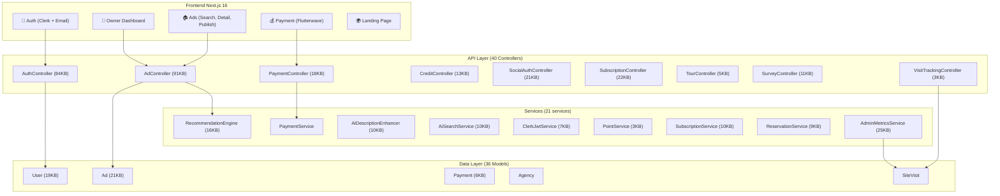

# 🔍 Rapport d'Audit Codebase KeyHome

> **Date :** 22 mars 2026 | **Auditeur :** Antigravity | **Version :** v3.0\
> **Stack :** Laravel 12 / PHP 8.4 + Next.js 16 / React 19 / TypeScript 5\
> **Criticité :** Code en production (VPS auto-hébergé) + features en cours\
> **Public :** Équipe technique + parties prenantes non-techniques

---

## 1. Résumé Fonctionnel

KeyHome est une **marketplace immobilière pour l'Afrique francophone** qui connecte propriétaires/agences et locataires. Les propriétaires publient des annonces (photos, GPS, attributs détaillés) qui sont modérées par un admin avant publication. Les locataires cherchent via recherche intelligente (MeiliSearch + NLP), consultent les fiches, et **débloquent les contacts** en payant (crédits ou paiement direct via Flutterwave/FedaPay/Mobile Money). Le système intègre un moteur de recommandation IA, des visites virtuelles 3D, des réservations de visites, des contrats de bail générés par IA, un système de crédits/points, un push notifications PWA, des alertes de recherche, des sondages, et un panel admin avancé avec métriques AARRR complètes.

**Depuis la dernière analyse (28 février),** le codebase a considérablement évolué : 40 controllers (+15), 36 models (+20), 493 lignes de routes (+227), ajout de Flutterwave comme gateway de paiement, système de crédits/points, tours 3D, contrats de bail IA, réservations de visites, sondages, codes promo, newsletter, recherche NLP, heatmap des prix, estimateur de loyer, KeyScore, et PWA push notifications.

---

## 2. Modules & Interdépendances

### Architecture des Modules

### Tailles des Controllers (drapeaux rouges)

| Controller | Taille | Lignes | Verdict |
|-----------|--------|--------|---------|
| `AdController.php` | **91 KB** | ~2800 | 🔴 **À séparer absolument** |
| `AuthController.php` | **84 KB** | 2192 | 🔴 **À séparer absolument** |
| `UserController.php` | 30 KB | ~900 | 🟡 Extractable |
| `SubscriptionController.php` | 22 KB | ~700 | 🟡 Borderline |
| `SocialAuthController.php` | 21 KB | ~650 | 🟡 Borderline |
| `PaymentController.php` | 18 KB | 521 | ✅ OK |
| `AdminMetricsService.php` | 25 KB | 579 | ✅ OK (service, pas controller) |

### Interdépendances Critiques

| Source → Destination | Nature | Risque |
|---------------------|--------|--------|
| `AuthController` → `ClerkJwtService` → Clerk API | Auth externe | Latence, SPOF |
| `PaymentController` → `PaymentService` → Flutterwave/FedaPay API | Paiement externe | Financier |
| `AdController` → `RecommendationEngine` → DB (N+1 potentiels) | IA interne | Performance |
| `AdminMetricsService` → `SiteVisit` + 10 models | Analytics | Performance DB |
| `CreditController` → `PointService` → `Payment` | Monnaie virtuelle | Intégrité financière |

---

## 3. Algorithmes & Fonctions Clés

### 🧠 Moteur de Recommandation (`RecommendationEngine`, 16KB)

**Algorithmique :** Score pondéré multi-critères combinant préférences utilisateur (ville, type, budget), historique d'interactions (vues, favoris, recherches), proximité géographique (PostGIS `ST_Distance`), fraîcheur de l'annonce, et boost payant.

### 📊 Métriques AARRR (`AdminMetricsService`, 579 lignes)

**Implémente le framework AARRR complet :**
- **Acquisition :** Visiteurs uniques par source (SiteVisit), taux de conversion, revenu par canal
- **Activation :** Taux de complétion profil, temps moyen première action, taux première publication
- **Retention :** DAU/WAU/MAU, stickiness (DAU/MAU), taux de retour 7j, analyse cohortale
- **Revenue :** MRR, ARPU, LTV par rôle, churn rate, projection linéaire 3/6/12 mois
- **Quality :** NPS, taux de signalement, taux de fraude, temps moyen vers location

### 🔍 Classification de Source (`VisitTrackingController`)

**Algorithme de classification en cascade :**
1. Si `utm_medium` = cpc/ppc/paid → `paid`
2. Si `utm_medium` = social → `social`
3. Si `utm_medium` = email/newsletter → `email`
4. Si UTM présent mais non classifié → `referral`
5. Si pas de referrer → `direct`
6. Si referrer ∈ domaines sociaux → `social`
7. Si referrer ∈ moteurs de recherche → `organic`
8. Sinon → `referral`

### 💰 Système de Paiement Multi-Gateway (`PaymentService`)

Abstraction complète derrière `PaymentService` avec support Flutterwave + FedaPay. Validation HMAC des webhooks. Résolution serveur-side du montant (empêche la manipulation côté client). Transactions DB atomiques.

### 🔐 Auth Multi-Chemin

3 chemins parallèles : email/password (Sanctum direct), OAuth (Google/Facebook/Apple via Socialite), Clerk (JWT exchange + OTP optionnel). Protection anti multi-comptes par IP.

---

## 4. Erreurs & Vulnérabilités

### 🔴 Critique

| # | Problème | Localisation | Impact |
|---|---------|-------------|--------|
| C1 | **AdController = 91KB / ~2800 lignes** | `AdController.php` | Maintenance impossible, merge conflicts constants, tests partiels. **God Object anti-pattern.** |
| C2 | **AuthController = 84KB / 2192 lignes** | `AuthController.php` | Même problème. La logique Clerk, OAuth, email, registration, password reset, onboarding, 2FA est dans un seul fichier. |
| C3 | **Aucun test frontend** | `keyhome-frontend-next/` | Vitest configuré, 0 tests écrits. Les régressions ne sont détectées qu'en production. |
| C4 | **Pas d'attribution UTM → User** | Flow registration | `SiteVisit` capture les UTM mais l'information est **perdue** à l'inscription. Impossible de savoir quel canal a amené un utilisateur payant. |

### 🟠 Haute sévérité

| # | Problème | Localisation | Impact |
|---|---------|-------------|--------|
| H1 | **Routes dupliquées Invoices** | `routes/api.php` L306-310 vs L260-264 (ancienne analyse) | Nettoyé ? À vérifier — potentiel conflit de routing |
| H2 | **Closures inline dans les routes** | `routes/api.php` L139-151, L210-239 | Pas de route caching possible (`php artisan route:cache` échoue avec closures). Impact perf en production. |
| H3 | **AdminMetricsService : requêtes N+1 cachées** | `AdminMetricsService.php` | Le caching masque le problème mais les cold hits peuvent saturer la DB avec des JOIN LATERAL et sous-requêtes corrélées. |
| H4 | **`resolveAmountForType()` retourne null pour types inconnus** | `PaymentController.php` L143-150 | Si un nouveau type est ajouté sans mise à jour du `match`, le paiement échoue silencieusement. |
| H5 | **Pas de rate-limit sur la lecture des SiteVisits** | N/A — pas d'endpoint de lecture | Les métriques admin utilisent le cache mais pas de pagination sur les exports. |

### 🟡 Moyenne sévérité

| # | Problème | Localisation | Impact |
|---|---------|-------------|--------|
| M1 | **`SubscriptionService` instanciée avec `new`** | `PaymentController.php` L472 | Contourne l'injection de dépendances. Impossible de mocker dans les tests. |
| M2 | **Manque `utm_content` et `utm_term`** | `VisitTrackingController.php` | Les 5 paramètres UTM standards ne sont pas tous capturés. Impossible de distinguer les variantes d'une même campagne. |
| M3 | **Pas de validation sur `utm_source` / `utm_campaign`** | `VisitTrackingController.php` | N'importe quelle chaîne est acceptée. Pas de sanitization avancée. |
| M4 | **`SiteVisit.user_id` souvent null** | `SiteVisit` model | La plupart des visites sont anonymes. Le lien SiteVisit→User n'est fait que si `$request->user()` est non-null, ce qui est rare pour un tracking anonyme. |

### 🟢 Mineur

| # | Problème | Localisation | Impact |
|---|---------|-------------|--------|
| L1 | **`.DS_Store` dans le repo** | Racine + `app/`, `database/` | Pollution du repo. Ajouter à `.gitignore`. |
| L2 | **`console.log` dans le frontend** | Divers fichiers TSX | Fuite d'informations de debug en production. |
| L3 | **Pas de `strict_types` dans certains modèles** | Quelques fichiers | Incohérence avec la norme du projet. |

---

## 5. Recommandations (Priorisées)

### 🔴 Priorité 1 — Immédiat (dette technique critique)

| # | Action | Effort | Impact |
|---|--------|--------|--------|
| R1 | **Découper `AdController`** en 5+ controllers : `AdSearchController`, `AdCrudController`, `AdStatusController`, `AdNearbyController`, `AdFacetsController` | 2-3 jours | Maintenabilité ×5 |
| R2 | **Découper `AuthController`** en : `LoginController`, `RegisterController`, `PasswordController`, `ClerkAuthController`, `OAuthController`, `OnboardingController` | 2-3 jours | Maintenabilité ×5 |
| R3 | **Implémenter le tracking UTM → User** (voir section ci-dessous) | 1-2 jours | ROI marketing mesurable |
| R4 | **Écrire les premiers tests Vitest** pour AuthProvider, PaymentFlow, AdDetail | 2-3 jours | Fiabilité frontend |

### 🟡 Priorité 2 — Court terme (1-2 sprints)

| # | Action | Effort | Impact |
|---|--------|--------|--------|
| R5 | **Remplacer closures dans routes** par méthodes de controller + création d'un `StatsController` | 1 jour | `route:cache` activable |
| R6 | **Ajouter `utm_content` et `utm_term`** au SiteVisit + migration | 0.5 jour | Tracking complet |
| R7 | **Injecter `SubscriptionService` via DI** au lieu de `new SubscriptionService` | 0.5 jour | Testabilité |
| R8 | **Créer une ressource Filament `SiteVisitResource`** dans le panel Admin | 1 jour | Visibilité acquisition |

### 🟢 Priorité 3 — Moyen terme

| # | Action | Effort | Impact |
|---|--------|--------|--------|
| R9 | **Ajouter des index DB** sur `site_visits(user_id)`, `site_visits(utm_source, visited_at)` | 0.5 jour | Performance requêtes analytics |
| R10 | **Implémenter le RBAC granulaire** au lieu de `can:admin-access` simple | 2 jours | Sécurité |
| R11 | **Paginer les exports AdminMetrics** | 0.5 jour | Stabilité avec gros volumes |
| R12 | **Ajouter `.DS_Store` au `.gitignore`** | 5 min | Propreté repo |

---

## Score Global

| Dimension | Note | Commentaire |
|-----------|------|-------------|
| **Architecture** | 7/10 | Solide (API-first, services, DI) mais 2 God Objects critiques |
| **Sécurité** | 8.5/10 | HMAC webhooks, rate limiting, anti multi-comptes, CSP headers |
| **Qualité du code** | 8/10 | `strict_types`, PHPStan level max, Pint, Rector. Quelques incohérences |
| **Tests** | 4/10 | 29 tests PHP, 0 frontend. Couverture critique insuffisante |
| **Performance** | 7.5/10 | Cache agressif, indexes DB, mais N+1 potentiels dans AdminMetrics |
| **Observabilité** | 9/10 | Sentry, Telescope, Pulse, Nightwatch, ActivityLog — excellent |
| **Analytics** | 8/10 | AARRR complet mais attribution UTM→User manquante |
| **Global** | **7.4 / 10** | Projet mature et professionnel avec dette technique identifiable |

---

*Rapport généré par Antigravity — 22 mars 2026*
