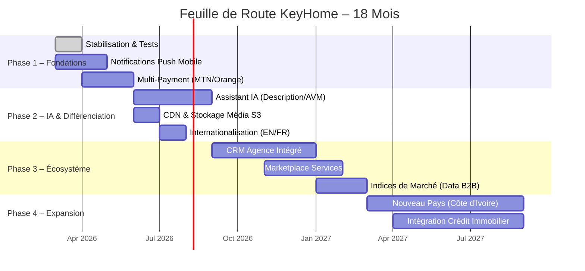

# Rapport d'Analyse Stratégique — **ImmoApp / KeyHome Backend**
> **Date de l'analyse :** 22 février 2026  
> **Base technologique :** Laravel 12 · PHP 8.4 · Filament 4 · PostgreSQL/PostGIS · MeiliSearch · React Native (mobile)  
> **Auteur de l'analyse :** Antigravity – Analyste Technique Stratégique

---

## Sommaire

1. [Inventaire des Fonctionnalités Existantes](#1-inventaire-des-fonctionnalités-existantes)
2. [Recommandations Stratégiques à Fort Potentiel](#2-recommandations-stratégiques-à-fort-potentiel)
3. [Analyse SWOT](#3-analyse-swot)
4. [Feuille de Route Stratégique](#4-feuille-de-route-stratégique)

---

## 1. Inventaire des Fonctionnalités Existantes

### 🔐 Authentification & Gestion des Utilisateurs

- **Inscription multi-profils** : clients, agents individuels (bailleurs) et agents d'agence, avec rôles distincts (`CUSTOMER`, `AGENT`, `ADMIN`)
- **Connexion classique** avec limitation de débit (throttle 5 req/min) et vérification d'email obligatoire
- **Authentification sociale OAuth 2.0** via Google, Facebook et Apple — liaison/déliaison de comptes providers
- **Intégration Clerk** : échange JWT Clerk → token Sanctum, vérification OTP, complétion de profil
- **Réinitialisation de mot de passe** par email avec template personnalisé
- **Double authentification (2FA)** via application TOTP et via email (protocoles `HasAppAuthentication`, `HasEmailAuthentication`)
- **Gestion des sessions** : révocation de tokens Sanctum, actualisation des tokens
- **Suivi des connexions** : IP de dernière connexion, date/heure de dernière session
- **Soft-delete des utilisateurs** (suppression logique, restaurable)
- **Génération automatique d'avatar** via Laravolt Avatar (image initiales personnalisée)
- **Vérification email avec URL temporaire signée**

### 🏠 Gestion des Annonces Immobilières

- **CRUD complet des annonces** avec contrôle d'accès par rôle et politique (Policies)
- **Statuts d'annonce avec machine à états validée** : `pending → available → reserved/rent/sold` (transitions interdites vérifiées)
- **Bascule de visibilité** : activer/désactiver une annonce sans la supprimer
- **Gestion de la disponibilité** : plage de dates `available_from` / `available_to`
- **Annonces boostées** (`is_boosted`, `boost_score`, `boost_expires_at`) pour mise en avant payante
- **Workflow de validation** : les nouvelles annonces sont créées en statut `pending` ; les administrateurs les approuvent pour passer à `available`
- **Notification admin** par email lors de toute nouvelle soumission d'annonce
- **Slug automatique et unique** généré à la création et mis à jour à la modification du titre
- **Attributs de bien dynamiques** (JSON) : liste extensible de caractéristiques (balcon, piscine, gardien, etc.) via l'enum `PropertyAttribute`
- **Multi-médias** : galerie d'images (jusqu'à 10) avec conversions automatiques en WebP (thumb 300px, medium 800px, large 1200px), document PDF état des lieux
- **Géolocalisation PostGIS** : coordonnées GPS stockées en type `Point`, recherche d'annonces à proximité (nearby search) par rayon
- **Soft-delete des annonces**
- **Journal d'activité complet** via Spatie Activitylog (toutes modifications tracées)

### 🔍 Recherche & Découverte

- **Moteur de recherche full-text MeiliSearch** (via Laravel Scout) avec indexation automatique des annonces visibles et disponibles
- **Recherche avancée** : filtres par ville, quartier, type, prix, surface, chambres, salle de bains, parking, statut, attributs
- **Auto-complétion** des requêtes de recherche
- **Facettes** : agrégats pour les filtres dynamiques (types, villes, fourchettes de prix)
- **Recherche géographique** : annonces à proximité d'une position GPS (endpoint public `/ads/nearby`)
- **Moteur de recommandation personnalisé** (*Weighted Scoring v2 + Diversity Injection*) :
  - Construction d'un profil utilisateur à partir des 30 dernières interactions avec décroissance temporelle exponentielle
  - Scoring pondéré : type de bien (×40), ville (×25), budget (×20), fraîcheur (×10), popularité (×5), bonus boost (×15)
  - 20 % des résultats réservés à la « découverte » (anti-bulle de filtre)
  - *Cold Start* : mélange trending + boosted + latest pour les nouveaux utilisateurs
  - Cache 10 minutes par utilisateur

### 💳 Paiements & Monétisation

- **Intégration FedaPay** (passerelle de paiement Afrique de l'Ouest, XOF) pour les deux flux monétaires :
  - **Déverrouillage d'annonce** : paiement à l'acte pour accéder aux coordonnées complètes du propriétaire et à la galerie intégrale
  - **Abonnement agence** : paiement mensuel ou annuel pour les plans agence
- **Webhooks sécurisés FedaPay** : gestion des événements `approved`, `canceled`, `declined` avec mise à jour atomique du statut de paiement
- **Transactions DB atomiques** pour garantir la cohérence données-paiement
- **Prix de déverrouillage configurable** via le modèle `Setting`
- **Historique des paiements** par utilisateur
- **Facturation** : modèle `Invoice` associé aux paiements
- **Annonces déverrouillées** : endpoint dédié `/my/unlocked-ads`

### 📦 Abonnements & Plans Agence

- **Plans d'abonnement** (`SubscriptionPlan`) : consultation publique des plans disponibles
- **Souscription et annulation** d'abonnement via API (avec throttle)
- **Statuts d'abonnement** : `active`, `expired`, `canceled`, `pending`
- **Historique d'abonnement** par utilisateur/agence
- **Abonnement courant** : endpoint `/subscriptions/current`

### 📊 Analytique & Interactions

- **Tracking des interactions utilisateurs** (avec limitation de débit) :
  - Vues (`view`)
  - Favoris / Dé-favoris (`favorite` / `unfavorite`)
  - Impressions (`impression`)
  - Partages (`share`)
  - Clics sur les coordonnées (`contact-click`)
  - Clics sur le numéro de téléphone (`phone-click`)
- **Dashboard analytique** pour bailleurs et agences :
  - Vue d'ensemble (`/my/ads/analytics`) : KPIs globaux
  - Détail par annonce (`/my/ads/{ad}/analytics`)
- **Liste de favoris** personnelle : `/my/favorites`
- **Tendances** : calcul des annonces populaires (vues 7 jours) pour le cold start

### ⭐ Avis & Notations

- **Système de reviews** : les utilisateurs laissent des avis et notes sur les annonces
- **Lecture publique** des avis par annonce (`GET /ads/{ad}/reviews`)
- **Soumission authentifiée** avec throttle (10 req/min)

### 🔔 Notifications

- **Notifications in-app** (base de données) : liste, compteur de non-lus, marquage lu individuellement ou en masse, suppression
- **Notifications email** : vérification email, réinitialisation mot de passe, notification admin pour nouvelles annonces

### 🏢 Gestion des Agences

- **CRUD agences** (partiellement public pour la consultation)
- **Multi-tenancy Filament** : chaque agent d'agence n'accède qu'aux données de son agence
- **Service de gestion agence** (`AgencyService`) pour l'affectation des agents

### 🗺️ Référentiel Géographique

- **CRUD Villes** (`City`) : lecture publique, écriture authentifiée
- **CRUD Quartiers** (`Quarter`) : lecture publique, écriture authentifiée
- **Types d'annonces** (`AdType`) : catégorisation des biens (appartement, villa, bureau, etc.)

### 🛠️ Panneaux d'Administration Filament

- **Panneau Admin** (`/admin`) : gestion complète de toutes les ressources (utilisateurs, annonces, agences, paiements, abonnements, plans, villes, quartiers, types, paramètres, logs d'activité), widgets de tableau de bord, exports/imports
- **Panneau Agency** (`/agency`) : espace agence multi-tenant pour la gestion des annonces et des agents
- **Panneau Bailleur** (`/bailleur`) : espace bailleur individuel pour la gestion de ses annonces
- **Exports** : exports de données en CSV/Excel
- **Imports** : imports en masse de données

### 🔧 Infrastructure & Qualité

- **API RESTful versionnée** (`/api/v1/...`) avec documentation OpenAPI/Swagger (Darkaonline L5-Swagger)
- **Rate limiting généralisé** sur tous les endpoints sensibles
- **Monitoring** : Sentry (erreurs), Laravel Telescope (debug), Laravel Pulse (performance), Laravel Nightwatch
- **CI/CD** : pipeline GitLab CI complet (lint, tests, build Docker, déploiement)
- **Docker** : orchestration Docker Compose multi-services (PHP, Nginx, PostgreSQL, Redis, Meilisearch)
- **Tests** : Pest (PHP), couverture de types
- **Qualité de code** : PHPStan/Larastan (niveau strict), PHP-CS-Fixer (Pint), Rector (refactoring automatisé)
- **Pont natif mobile** (`filament-native-bridge.js`) : bridge JavaScript pour l'application React Native
- **Application mobile** React Native (`/mobile`) avec service OAuth dédié

---

## 2. Recommandations Stratégiques à Fort Potentiel

---

### 🤖 Feature #1 — Assistant IA « KeyHome Intelligence » : Description, Valorisation & Scoring Automatique

#### Description
Intégrer un assistant IA générative (via l'API OpenAI GPT-4o ou un modèle fine-tuné) directement dans le flux de création d'annonce. L'IA analyse les photos du bien, les caractéristiques saisies (surface, chambres, localisation, attributs) et génère automatiquement une description commerciale convaincante. En parallèle, un module d'**Automated Valuation Model (AVM)** estime le prix de marché du bien en comparant avec les annonces similaires de la base de données (prix/m², quartier, période).

#### Valeur Proposée & Impact Marché
- **Pour les bailleurs/agences** : gain de temps massif (rédaction en < 30 sec vs. 20 min), descriptions professionnelles de qualité homogène, pricing data-driven pour éviter les biens surévalués ou sous-évalués.
- **Pour la plateforme** : différenciant fort face aux portails classiques africains (Jumia House, Immo Cameroun) qui n'ont aucune fonctionnalité IA. Positionnement « PropTech premium ».
- **Monétisation** : l'IA peut être un service premium inclus dans les abonnements supérieurs ou vendu à la génération (ex. 200 XOF/description).
- **Impact estimé** : +40 % de taux de complétion des annonces, réduction des annonces de mauvaise qualité, augmentation du taux de conversion visiteur → contact.

#### Faisabilité Technique & Points d'Intégration
- **Intégration naturelle** dans le panneaux Filament existant et l'API REST : nouvel endpoint `POST /ads/ai-describe` et `GET /ads/ai-estimate-price`.
- **Codebase** : le modèle `Ad` expose déjà toutes les données nécessaires (`attributes`, `surface_area`, `bedrooms`, `price`, `quarter`). La Spatie MediaLibrary fournit les URLs des images.
- **Infrastructure** : ajout d'un `AiService` dans `app/Services/`, d'un job `GenerateAdDescriptionJob` en queue (déjà configurée dans le projet) et d'une colonne `ai_score` sur la table `ad`.
- **Effort estimé** : 3-4 sprints (6-8 semaines).

---

### 🛡️ Feature #2 — Marketplace de Services Immobiliers & Partenaires de Confiance

#### Description
Créer un **écosystème tiers** en connectant la plateforme à des prestataires de confiance : déménageurs, notaires, diagnostiqueurs techniques, assureurs locataires, décorateurs d'intérieur. Chaque prestataire dispose d'un profil vérifié et peut recevoir des demandes de devis directement depuis une page d'annonce.

#### Valeur Proposée & Impact Marché
- **Pour les locataires/acheteurs** : expérience « one-stop shop » ; toutes les démarches post-recherche centralisées dans une seule app.
- **Pour la plateforme** : nouvelles lignes de revenus via commissions sur les mises en relation (ex. 3-5 % du devis), ou abonnement partenaire mensuel. Modèle éprouvé par MeilleursAgents (France) et Zillow (USA).
- **Pour le marché africain** : fort potentiel dans des économies où les prestataires fiables sont difficiles à trouver — la certification KeyHome devient un label de confiance.
- **Impact estimé** : +15-25 % de revenus additionnels à maturité, augmentation de l'engagement utilisateur post-location.

#### Faisabilité Technique & Points d'Intégration
- **Nouveaux modèles** : `ServiceProvider`, `ServiceCategory`, `ServiceRequest` avec workflow de demande de devis (statuts).
- **Intégration API** : endpoints REST dédiés (`/service-providers`, `/service-requests`) + nouveau panneau Filament « Partenaires ».
- **Lien annonce** : ajout d'un composant Livewire sur la page d'annonce pour déclencher une demande de service.
- **Le système de paiement FedaPay** existant peut gérer les transactions de mise en relation.
- **Effort estimé** : 4-5 sprints (8-10 semaines).

---

### 📈 Feature #3 — CRM Intégré & Gestion de Pipeline Locatif/Transactionnel pour Agences

#### Description
Transformer le panneau Agence en un véritable **CRM immobilier** : gestion des leads (prospects entrants via les clics de contact et phone-click déjà trackés), pipeline de transactions en kanban (prospect → visite → offre → bail signé), suivi des relances automatiques (emails + notifications push), et tableau de bord de performance commerciale consolidé.

#### Valeur Proposée & Impact Marché
- **Pour les agences** : élimination des outils tiers (Excel, CRM génériques) ; tout est centralisé dans KeyHome. Fidélisation des agents abonnés.
- **Pour la plateforme** : augmentation drastique de la valeur perçue des abonnements agence → augmentation des prix d'abonnement justifiée, réduction du churn.
- **Positionnement** : aucun portail immobilier d'Afrique subsaharienne ne propose un CRM natif. C'est un positionnement **inédit et défensif** (switching cost élevé).
- **Impact estimé** : ×2 à ×3 sur l'ARPU (revenu moyen par utilisateur) des comptes agence, réduction du taux de churn agence de 30-40 %.

#### Faisabilité Technique & Points d'Intégration
- **Infrastructure existante** : le tracking des interactions (`AdInteraction` : `contact-click`, `phone-click`) constitue déjà la base des leads. La relation `Agency ↔ User ↔ Ad` est en place.
- **Nouveaux modèles** : `Lead`, `LeadStatus` (enum), `Deal`, `DealStage`, `Activity` (appels, emails, visites).
- **Interface** : widgets Filament kanban dans le panneau Agency, nouvelles relations et ressources.
- **Automatisation** : jobs de relance programmés via les Scheduled Tasks Laravel (déjà configuré dans `app/Console`).
- **Effort estimé** : 5-6 sprints (10-12 semaines).

---

## 3. Analyse SWOT

### 💪 Forces (Strengths)

| # | Force | Justification |
|---|-------|---------------|
| 1 | **Stack technologique moderne et robuste** | Laravel 12, PHP 8.4 strict, Filament 4, PostGIS, MeiliSearch — outillage de niveau production enterprise. |
| 2 | **Moteur de recommandation IA maison** | Algorithme de scoring pondéré avec décroissance temporelle et injection de diversité : sophistication rare pour une start-up africaine. |
| 3 | **Authentification multi-providers complète** | Google, Facebook, Apple, Clerk + 2FA TOTP/Email : couverture maximale des cas d'usage utilisateurs. |
| 4 | **Architecture multi-panel Filament** | Trois panneaux distincts (Admin, Agency, Bailleur) avec multi-tenancy : segmentation claire des rôles, expérience adaptée à chaque acteur. |
| 5 | **Géolocalisation native PostGIS** | Recherche géographique précise par coordonnées, base solide pour des fonctionnalités cartographiques avancées. |
| 6 | **Pipeline CI/CD et industrialisation** | GitLab CI, Docker, Sentry, Telescope, PHPStan strict : qualité de code et déploiement automatisé de niveau professionnel. |
| 7 | **Modèle de monétisation double** | Freemium (unlock à l'acte) + SaaS (abonnement agence) : deux sources de revenus complémentaires. |
| 8 | **Tracking comportemental granulaire** | 6 types d'interactions trackées, base de données comportementale précieuse pour l'optimisation et la publicité ciblée. |

---

### ⚠️ Faiblesses (Weaknesses)

| # | Faiblesse | Justification |
|---|-----------|---------------|
| 1 | **Dépendance à un seul prestataire de paiement** | FedaPay uniquement ; si le prestataire tombe ou augmente ses frais, toute la monétisation est bloquée. Absence de fallback (MTN Mobile Money direct, Orange Money, Wave). |
| 2 | **Absence de tests automatisés suffisants** | Un framework Pest est en place mais la couverture réelle de tests n'est pas garantie ; des migrations complexes et des services critiques (paiement) sans tests unitaires représentent un risque. |
| 3 | **Recommandation sans feedback explicite** | Le moteur de recommandation se base uniquement sur les interactions implicites ; l'absence de feedback utilisateur explicite (« je n'aime pas ce type de bien ») limite la personnalisation. |
| 4 | **Application mobile partielle** | Le répertoire `/mobile` contient une app React Native, mais les services OAuth et la bridge semblent en développement — risque de fragmentation de l'expérience. |
| 5 | **Localisation non implémentée** | Le projet ne contient qu'un répertoire `lang/` minimal ; l'absence de multi-langues (français/anglais) limite l'expansion vers des marchés anglophones d'Afrique. |
| 6 | **Absence de CDN pour les médias** | Les images sont stockées sur le disque local du serveur Docker ; pas d'intégration Cloudflare/Cloudinary/S3 pour la performance à l'échelle. |
| 7 | **Pas de notifications push mobiles** | Les notifications sont in-app (base de données) et email — absence de push notifications via FCM/APNs pour le mobile. |

---

### 🚀 Opportunités (Opportunities)

| # | Opportunité | Justification |
|---|-------------|---------------|
| 1 | **Digitalisation accélérée du marché immobilier africain** | L'Afrique subsaharienne connaît une urbanisation rapide (taux d'urbanisation prévu à 60 % d'ici 2050) ; la demande de plateformes immobilières digitales va exploser. |
| 2 | **Quasi-absence de concurrents technologiquement comparables** | Les portails existants (Jumia House, Immo Cameroun) sont technologiquement dépassés ; aucun ne propose IA, recommandation avancée ou CRM. |
| 3 | **Mobile Money omniprésent** | L'intégration directe de MTN Mobile Money et Orange Money (via leurs API) permettrait de toucher les segments non bancarisés, représentant 70 %+ de la population. |
| 4 | **Expansion géographique rapide** | L'architecture multi-villes et multi-quartiers est déjà en place ; déploiement dans d'autres pays CEMAC (Gabon, Congo, RCA) ou UEMOA (Côte d'Ivoire, Sénégal) est facilité. |
| 5 | **Données comme actif stratégique** | Les interactions comportementales collectées permettront de construire des indices de marché (prix/m² par quartier), vendables aux banques, assureurs et institutions. |
| 6 | **Intégration de services financiers** | Partenariats avec des fintechs pour proposer directement un accès au crédit immobilier ou micro-crédit pour la caution depuis la page d'annonce. |
| 7 | **IA générative pour le marché local** | Le fine-tuning d'un LLM sur des données immobilières locales (vocabulaire, prix locaux) créerait une barrière à l'entrée technologique durable. |

---

### ⚡ Menaces (Threats)

| # | Menace | Justification |
|---|--------|---------------|
| 1 | **Entrée d'acteurs internationaux bien financés** | Airbnb, Zillow ou des fonds de PropTech pourraient décider d'investir massivement sur le marché africain. |
| 2 | **Instabilité réglementaire** | Les réglementations sur la protection des données personnelles (lois type RGPD en Afrique) évoluent rapidement ; non-conformité = sanctions et perte de confiance. |
| 3 | **Fragilité de l'infrastructure réseau locale** | La qualité de la connectivité mobile en zones périurbaines reste aléatoire ; une app full-backend peut souffrir d'une mauvaise perception si hors-ligne. |
| 4 | **Risque de fraude à l'annonce** | Sans vérification physique des biens, la plateforme peut devenir vecteur d'arnaques, ce qui détruirait la confiance utilisateur. |
| 5 | **Dépendance aux APIs tierces** | Clerk, Google OAuth, FedaPay, MeiliSearch (self-hosted mais open-source) — toute modification de conditions d'utilisation ou panne est critique. |
| 6 | **Coût d'acquisition utilisateur élevé** | Sans stratégie SEO (la plateforme est API-first, sans SSR public), la découverte organique est quasi nulle ; la dépendance aux canaux payants est coûteuse. |

---

## 4. Feuille de Route Stratégique

### Vue d'ensemble

---

### Phase 1 — Consolidation & Fiabilité (Mars – Juin 2026)

> **Objectif :** Solidifier les fondations avant d'accélérer la croissance.

#### 1.1 Couverture de Tests & Sécurité

- [ ] Atteindre 70 %+ de couverture de tests (Pest) sur les services critiques : `PaymentController`, `AuthController`, `RecommendationEngine`
- [ ] Audit de sécurité : validation de tous les webhooks FedaPay par signature HMAC, revue des politiques d'autorisation (Policies)
- [ ] Mise en place de la conformité RGPD légère : export des données utilisateur, droit à l'effacement complet (au-delà du soft-delete)

#### 1.2 Notifications Push Mobiles

- Intégrer **Firebase Cloud Messaging (FCM)** et **APNs** via le package `laravel-notification-channels/fcm`
- Adapter les `Notification` existantes pour diffuser sur le canal push en plus du canal database
- Ajouter un endpoint d'enregistrement de device token : `POST /api/v1/devices/register`

#### 1.3 Multi-Payment (MTN Mobile Money & Orange Money)

- Intégrer l'API MTN MoMo Cameroun et Orange Money API
- Abstraire le `PaymentService` derrière une interface `PaymentGatewayInterface` avec implémentations `FedaPayGateway`, `MTNGateway`, `OrangeMoneyGateway`
- Proposer la sélection du mode de paiement dans l'application mobile

**Jalons clés :** Couverture 70 % atteinte · Push notifications opérationnelles · 3 modes de paiement disponibles

---

### Phase 2 — IA & Différenciation Technologique (Juin – Septembre 2026)

> **Objectif :** Créer un avantage concurrentiel durable par l'intelligence artificielle.

#### 2.1 Assistant IA « KeyHome Intelligence »

- Créer `app/Services/AiService.php` intégrant l'API OpenAI (GPT-4o) avec un prompt système optimisé pour le marché immobilier africain francophone
- Développer l'**Automated Valuation Model (AVM)** : calcul du prix estimé par régression sur les annonces validées (prix/m² × surface, pondéré par quartier et époque)
- Ajouter le composant IA dans le formulaire de création d'annonce (Filament) avec bouton « Générer la description »
- Ajouter l'endpoint public `GET /api/v1/ads/{ad}/ai-insights` pour afficher les insights côté client

#### 2.2 CDN & Stockage Objet (S3-compatible)

- Migrer `spatie/laravel-medialibrary` vers un disque S3-compatible (AWS S3, Cloudflare R2 ou MinIO auto-hébergé)
- Activer la distribution via Cloudflare CDN pour les images WebP
- Impact : réduction de 80 % du temps de chargement des images sur mobile

#### 2.3 Internationalisation

- Compléter les fichiers de traduction dans `lang/fr/` et créer `lang/en/`
- Rendre le panneau Filament bilingue ; ajouter un paramètre `locale` dans les préférences utilisateur

**Jalons clés :** IA en production sur 3 marchés test · Temps de chargement images < 500 ms · Version anglaise disponible

---

### Phase 3 — Écosystème & Monétisation Avancée (Septembre 2026 – Mars 2027)

> **Objectif :** Transformer la plateforme en écosystème immobilier complet et maximiser les revenus par utilisateur.

#### 3.1 CRM Agence Intégré

- Créer les modèles `Lead`, `Deal`, `DealStage`, `DealActivity`
- Connecter automatiquement chaque `contact-click` et `phone-click` trackés à la création d'un `Lead` dans le CRM de l'agence concernée
- Développer une interface kanban dans le panneau Filament Agency (avec le widget Filament v4 Table Builder)
- Ajouter les relances automatiques par email (jobs planifiés) et notifications push
- **Monétisation** : réserver le CRM aux abonnements « Pro » et « Enterprise »

#### 3.2 Marketplace de Services

- Modèles : `ServiceProvider`, `ServiceCategory`, `ServiceRequest`, `ServiceReview`
- Workflow de vérification des partenaires par l'admin (panneau Admin)
- Widget « Services recommandés » sur la page d'annonce
- Intégration paiement FedaPay / MTN MoMo pour les transactions de mise en relation

#### 3.3 Indices de Marché (Offre B2B)

- Calcul automatique hebdomadaire des indices de marché par ville/quartier/type de bien via des jobs artisan
- API B2B dédiée pour exposer ces données (tokenisée, tarification à l'appel) : cible banques, assureurs, institutions

**Jalons clés :** CRM actif avec 20+ agences bêta · 50 partenaires services certifiés · Premiers contrats B2B data signés

---

### Phase 4 — Expansion Géographique & Financement (Mars – Septembre 2027)

> **Objectif :** Conquérir de nouveaux marchés et lever des fonds Série A.

#### 4.1 Déploiement en Côte d'Ivoire

- L'architecture multi-villes est déjà prête ; il suffit d'ajouter les villes et quartiers ivoiriens
- Adapter les modes de paiement : intégration Orange Money CI et Wave
- Recruter une équipe commerciale locale et adapter le contenu culturellement

#### 4.2 Intégration Crédit Immobilier (Partenariat FinTech)

- Partenariat avec une institution de microfinance ou une banque locale
- Widget « Simulation de prêt » sur la page d'annonce avec demande directe
- Reverse flow : les partenaires financiers accèdent aux annonces qualifiées via l'API B2B

#### 4.3 Positionnement Levée de Fonds

- **Métriques cibles pour la Série A** :
  - MAU (Monthly Active Users) : > 50 000
  - Agences abonnées : > 500
  - GMV (Gross Merchandise Volume) : > 50 M XOF/mois
  - NPS Score : > 40

**Jalons clés :** Lancement CI · 500+ agences abonnées · Dossier Série A constitué

---

## Conclusion Stratégique

**KeyHome / ImmoApp** dispose d'une base technique **exceptionnellement solide** pour son stade de maturité, surpassant de loin les standards du marché immobilier africain. Le moteur de recommandation IA, la géolocalisation PostGIS, l'architecture multi-tenant Filament et le pipeline CI/CD professionnel constituent des **avantages compétitifs durables**.

La priorité stratégique absolue est de :

1. **Sécuriser la fondation** (tests, paiements multiples, push) avant de croître
2. **Activer l'IA** pour créer un fossé technologique difficile à combler par les concurrents
3. **Monétiser davantage les agences** via le CRM pour multiplier l'ARPU
4. **S'étendre** avec une infrastructure déjà pensée pour le multi-pays

Avec une exécution disciplinée de cette feuille de route, un horizon de **valorisation à 7-10 chiffres (en USD)** est plausible sur 24-36 mois, notamment sur la thèse « PropTech leader d'Afrique francophone ».

---
*Rapport généré par Antigravity – Analyste Technique Stratégique | 22 février 2026*
